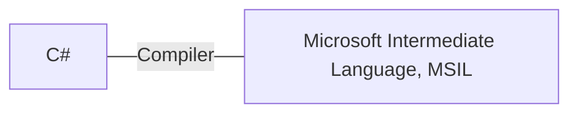
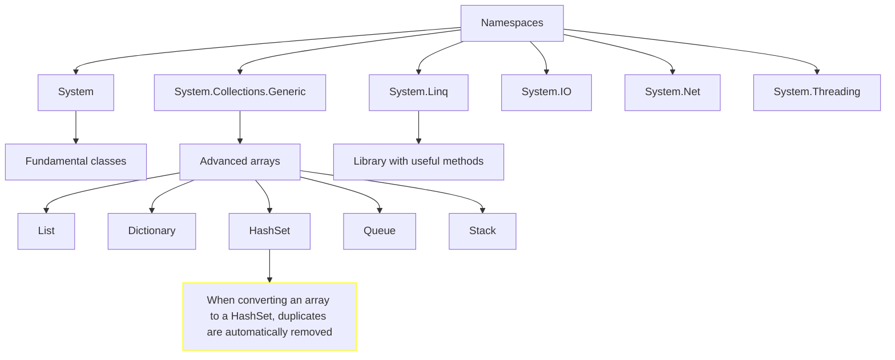

# C# Fundamentals

Source: [Microsoft](https://learn.microsoft.com/en-gb/training/)

## Table of contents

<!--TOC-->
- [First C# code](#first-c-code)
  - [Introduction](#introduction)
  - [Challenge 1: printing on console](#challenge-1-printing-on-console)
  - [Variables](#variables)
    - [Data types](#data-types)
    - [Implicitly typed local variables](#implicitly-typed-local-variables)
    - [Challenge 2: typed variables](#challenge-2-typed-variables)
    - [Character escape sequences](#character-escape-sequences)
    - [String interpolation](#string-interpolation)
    - [Challenge 3: string interpolation](#challenge-3-string-interpolation)
    - [Type casting](#type-casting)
    - [Challenge 4: operations](#challenge-4-operations)
  - [Project 1 : calculate average and query list](#project-1-calculate-average-and-query-list)
  - [Project 2 : calculate GPA](#project-2-calculate-gpa)
- [Exercism](#exercism)
  - [Basics](#basics)
  - [Booleans](#booleans)
  - [Strings](#strings)
    - [Substring](#substring)
    - [Regex](#regex)
  - [Numbers](#numbers)
  - [Extended methods](#extended-methods)
  - [Tuples](#tuples)
    - [Dictionary](#dictionary)
  - [Nullability](#nullability)
  - [While](#while)
    - [Do While](#do-while)
- [Unit testing](#unit-testing)
  - [Naming conventions](#naming-conventions)
- [General knowledge](#general-knowledge)
  - [32-bit (x86), 64-bit (x64)](#32-bit-x86-64-bit-x64)
  - [Namespaces](#namespaces)
  - [Glossary](#glossary)
  - [Variables](#variables)
    - [Primitive types: numeric](#primitive-types-numeric)
    - [Type casting](#type-casting)
    - [Primitive types: strings](#primitive-types-strings)
    - [Constants](#constants)
<!--/TOC-->

# First C# code

## Introduction

C# is a case-sensitive language.

`console` is different from `Console`.

Interpreting error messages is key:

```c#
console.WriteLine("i like ice cream");
```
```terminal
(1,1): error CS0103: The name 'console' does not exist in the current context
```




| Term | Definition | Example |
| --- | --- | --- |
| literal string | data is output literally | `"hello world"` |
| class | a class is an object, having methods live within it | `Console` |
| method | each method has one job; they live within classes | `WriteLine()` |

## Challenge 1: printing on console

```c#
Console.WriteLine("This is the first line.");
Console.Write("This is the second line.");
Console.Write("This is the third line.");
```
```terminal
This is the first line.
This is the second line.This is the third line.
```

## Variables

### Data types

Data typing is a key characteristic of C#: designers believed it can lead to avoiding common bugs.

| Data type | Use case | Example |
| --- | --- | --- |
| string | presentation or text manipulation | `string myString = "Hello";` |
| char | presentation or text manipulation | `char myChar = 'A';` |
| int | calculation | `int myInt = 10;` |
| float | calculation (6-9 digits) | `float mySmallNumber = 3.14f;` |
| double | calculation (15-17 digits; default in C#, no literal suffix needed) | `double myMediumNumber = 3.14;` |
| decimal | calculation (28-29 digits) | `decimal myLargeNumber = 3.14m;` |
| bool | evaluation | `bool myBool = true;` |

### Implicitly typed local variables

Use the `var` keyword: it tells the compiler that data type is implied.

```c#
var message = "hello world";
```

You can use `var` when the data type is not known.

However, it's best practice to always type your variables.

`/!\` C# always attributes a data type to a variable, even if implicit.

### Challenge 2: typed variables

```c#
string userName = "Bob";
int messageNumber = 3;
float temperature = 34.4f;

Console.WriteLine($"Hello, {userName}!");
Console.Write($"You have {messageNumber} messages in your inbox. The temperature is {temperature} celsius.");
```

```terminal
Hello, Bob!
You have 3 messages in your inbox. The temperature is 34.4 celsius.
```

### Character escape sequences

| Sequence | Description |
| --- | --- |
| `\n` | new line |
| `\t` | tab |
| `\"` | escape double-quotes |
| `\\` | escape back slashes |
| `@` | output verbatim (as is); keep whitespaces |

### String interpolation

```c#
string one = "hello";
string two = "world";
Console.Write($"{one} {two}");
```

```terminal
hello world
```

```c#
string projectName = "helloWorld";
Console.Write($@"C:\Output\{projectName}\Data");
```

```terminal
C:\Output\helloWorld\Data
```

### Challenge 3: string interpolation

```c#
string englishMessage = "View English output:";
string projectName = "ACME";
string englishProjectLocation = $@"c:\Exercise\{projectName}\data.txt";

Console.WriteLine($"{englishMessage}\n\t{englishProjectLocation}\n");

string russianMessage = "\u041f\u043e\u0441\u043c\u043e\u0442\u0440\u0435\u0442\u044c \u0440\u0443\u0441\u0441\u043a\u0438\u0439 \u0432\u044b\u0432\u043e\u0434";
string russianProjectLocation = $@"c:\Exercise\{projectName}\ru-RU\data.txt";

Console.WriteLine($"{russianMessage}\n\t{russianProjectLocation}\n");
```

```terminal
View English output:
	c:\Exercise\ACME\data.txt

Посмотреть русский вывод
	c:\Exercise\ACME\ru-RU\data.txt
```

### Type casting

Make a variable **pretend** to be a different type (within a sort of computed calculation):

```c#
int a = 10;
int b = 4;
double c = a / (double) b;
```

### Challenge 4: operations

```c#
int fahrenheit = 94;
float celsius = (fahrenheit - 32) * (5/9f);
Console.Write($"The temperature is {Math.Round(celsius, 1)} Celsius.");
```

```terminal
The temperature is 34.4 Celsius.
```

## Project 1 : calculate average and query list

```c#
// grades
int[] sophia = {93, 87, 98, 95, 100};
int[] nicolas = {80, 83, 82, 88, 85};
int[] zahirah = {84, 96, 73, 85, 79};
int[] jeong = {90, 92, 98, 100, 97};

// Averages
float sophiaAverage = (float) sophia.Sum() / sophia.Length;
float nicolasAverage = (float) nicolas.Sum() / nicolas.Length;
float zahirahAverage = (float) zahirah.Sum() / zahirah.Length;
float jeongAverage = (float) jeong.Sum() / jeong.Length;

// Grading
List<(int, int, string)> grades = new List<(int, int, string)> {
    (97, 100, "A+"),
    (93, 96, "A"),
    (90, 92, "A-"),
    (87, 89, "B+"),
    (83, 86, "B")
};

// List with results
List<(string, float, string)> results = new List<(string, float, string)> {
    ("Sophia", sophiaAverage, grades.FirstOrDefault(g => sophiaAverage >= g.Item1 && sophiaAverage <= g.Item2).Item3),
    ("Nicolas", nicolasAverage, grades.FirstOrDefault(g => nicolasAverage >= g.Item1 && nicolasAverage <= g.Item2).Item3),
    ("Zahirah", zahirahAverage, grades.FirstOrDefault(g => zahirahAverage >= g.Item1 && zahirahAverage <= g.Item2).Item3),
    ("Jeong", jeongAverage, grades.FirstOrDefault(g => jeongAverage >= g.Item1 && jeongAverage <= g.Item2).Item3),
};

Console.WriteLine(string.Join("\n", results));
```

```terminal
(Sophia, 94.6, A)
(Nicolas, 83.6, B)
(Zahirah, 83.4, B)
(Jeong, 95.4, A)
```

## Project 2 : calculate GPA

```c#
List<(string, int, int)> finalGrades = new List<(string, int, int)> {
("English 101", 4, 3),
("Algebra 101", 3, 3),
("Biology 101", 3, 4),
("Computer Science 101", 3, 4),
("Pyschology 101", 4, 3)
};

var credits = finalGrades.Select(g => g.Item2).ToArray();
var grades = finalGrades.Select(g => g.Item3).ToArray();

int[] results = new int[credits.Length];
for (int i = 0; i < results.Length; i++) {
    results[i] = credits[i] * grades[i];
}

float gpa = (results.Sum() / (float) credits.Sum());
gpa = (float)Math.Round(gpa, 2);

Console.Write(gpa);
```

# Exercism

## Basics

C# is a statically-typed language:

```c#
int explicitVar = 10; // Explicitly typed
var implicitVar = 10; // Implicitly typed
```

And an object-oriented language where functions are defined in classes.

Classes need to be instantiated using `new`:

```C#
class Calculator
{
    // ...
}

var calculator = new Calculator();
```

Classes group methods, whose parameters and return values need to be explicitly typed.

`public` allows a method to be called by code in other files.

```c#
class Calculator
{
    public int Add(int x, int y)
    {
        return x + y;
    }
}
```

Comments can be single line `//` or multiline `/* */`.

## Booleans

Type `bool`.

Operators `!` (NOT), `&&` (AND), and `||` (OR).

## Strings

### Substring

```c#
public static string Message(string logLine)
    {
        int first = logLine.IndexOf(":") + ":".Length;
        int last = logLine.Length;
        return logLine.Substring(first, last - first).Trim();
    }
```

```terminal
LogLine.Message("[ERROR]: Invalid operation")
// => "Invalid operation"
```

### Regex

```c#
public static string LogLevel(string logLine)
    {
        Regex rx = new Regex("\\[(.*)\\]");
        MatchCollection matches = rx.Matches(logLine);
        return matches[0].Groups[1].Value.ToLower();
    }
```

```terminal
// "[ERROR]: Disk full"
error
```

## Numbers

Digit separator:

```c#
int largeInt = 1_000_000;
// => 1000000

double largeDouble = 9_876_543.21;
// => 9876543.21
```

## Extended methods

```c#
// TODO: define the 'SubstringAfter()' extension method on the `string` type
    public static string SubstringAfter(this string str, string input) {
        return str.Split(input)[1];
    }
    // TODO: define the 'SubstringBetween()' extension method on the `string` type
    
    public static string SubstringBetween(this string str, string input1, string input2) {
        return str.Split(input1)[1].Split(input2)[0];
    }
    
    // TODO: define the 'Message()' extension method on the `string` type
    public static string Message(this string str) {
        return str.SubstringAfter("]:").Trim();
    }
    // TODO: define the 'LogLevel()' extension method on the `string` type
    public static string LogLevel(this string str) {
        return str.SubstringBetween("[", "]");
    }
```

```c#
public static class Bob
{
    // Check if string is uppercase
    private static bool IsUpperCase(this string statement) =>
        statement.Any(char.IsLetter) &&
        statement.All(e => !char.IsLetter(e) || char.IsUpper(e));

    // Check if string ends with ?
    private static bool IsQuestion(this string statement) => statement.Trim().EndsWith("?");
    
    public static string Response(string statement)
    {
        if (statement.IsQuestion() && statement.IsUpperCase()) {
            return "Calm down, I know what I'm doing!";
        }
    
        if (statement.IsQuestion()) {
            return "Sure.";
        }
    
        if (statement.IsUpperCase()) {
            return "Whoa, chill out!";
        }
    
        if (string.IsNullOrWhiteSpace(statement)) {
            return "Fine. Be that way!";
        }
            
        return "Whatever.";
    }
}
```

## Tuples

```c#
string boast = "All you need to know";
bool success = !string.IsNullOrWhiteSpace(boast);
(bool, int, string) triple = (success, 42, boast);
```

```c#
// Change tuple field names

// Name items in declaration
(bool success, string message) results = (true, "well done!");
bool mySuccess = results.success;
string myMessage = results.message;

// Name items in creating expression
var results2 = (success: true, message: "well done!");
bool mySuccess2 = results2.success;
string myMessage2 = results2.message;
```

```c#
public static class PhoneNumber
{
    private static string IsSplit(this string phoneNumber, int index) {
        return phoneNumber.Split("-")[index];
    }
    
    public static (bool IsNewYork, bool IsFake, string LocalNumber) Analyze(string phoneNumber)
    {
        return ((phoneNumber.IsSplit(0) == "212"), phoneNumber.IsSplit(1) == "555", phoneNumber.IsSplit(2));
    }

    public static bool IsFake((bool IsNewYork, bool IsFake, string LocalNumber) phoneNumberInfo) => phoneNumberInfo.IsFake;
}
```

### Dictionary

```c#
public static class ScrabbleScore
{
    public static int Score(string input)
        {
            List<(string, int)> tuples = new()
            {
                ("aeioulnrst", 1),
                ("dg", 2),
                ("bcmp", 3),
                ("fhvwy", 4),
                ("k", 5),
                ("jx", 8),
                ("qz", 10)
            };

            Dictionary<char, int> dictionary = new();

            foreach (var tuple in tuples)
            {
                foreach (char c in tuple.Item1)
                {
                    dictionary[c] = tuple.Item2;
                }
            }

            int count = 0;

            char[] charArray = input.ToLower().ToArray();

            foreach (char c in charArray)
            {
                count += dictionary[c];
            }
        
        return count;
    }
}
```

## Nullability

```c#
public static string Print(int? id, string name, string? department)
    {
        
        if (!id.HasValue && string.IsNullOrEmpty(department)) {
            return $"{name} - OWNER";
        }
        
        if (!id.HasValue) {
            return $"{name} - {department.ToUpper()}"; 
        }

        if (string.IsNullOrEmpty(department)) {
            return $"[{id}] - {name} - OWNER";
        }
        
        return $"[{id}] - {name} - {department.ToUpper()}";
    }
```

## While

```c#
int x = 23;

while (x > 10)
{
    // Execute logic if x > 10
    x = x - 2;
}
```

### Do While
```c#
int x = 23;

// Execute at least once, then loop
do
{
    // Execute logic if x > 10
    x = x - 2;
} while (x > 10)
```

# Unit testing

## Naming conventions

```c#
Namespaces, classes, methods: PascalCase;
Public variables: camelCase;
Private variables: m_camelCase;
Test methods: MethodTested_Scenario_ExpectedOutcome
```

# General knowledge

## 32-bit (x86), 64-bit (x64) 

In a nutshell, 16 (1978) -> 32 (1985) -> 64-bit (2003).

32-bit `int`: range from -2,147,483,648 to 2,147,483,647.

64-bit `int`: range from -9,223,372,036,854,775,808 to 9,223,372,036,854,775,807.

> The transition to 64-bit computing was indeed significant for handling complex data. The 64-bit architecture provides a larger address space, which means it can access more memory and handle larger data sets more efficiently. This is particularly beneficial for applications that require high-performance computing or are data-intensive, such as databases, scientific simulations, and video encoding. However, for many everyday applications, the difference between 32-bit and 64-bit might not be noticeable.


| Term | Acronym | Description | Extension |
| --- | --- | --- | --- |
| Access | | MS-provided relational DB manager like mySQL for small, end-user oriented projects. | .mdb |
| OLEDB | Object Linking and Embedding Database | MS API for accessing data. | |

## Namespaces

In C#, like in other languages, `namespaces` are containers that group similar classes, interfaces, functions and other code.



## Glossary

<!--| Term | Definition | Example |
| --- | --- | --- |
| compiler | *converts your code from a human higher-level language (C#) into an executable format that the computer can understand.* | x |
| precompilation | process before the main compilation process to help with performance | red squiggly lines underlining the code that will produce an error |
| programming language | *A programming language's job is to allow a human to express their intent [to a computer] in a human-readable and understandable way.* |
| syntax | rules for writing code | X |
----->

## Variables

| Category | Type | Example |
| --- | --- | --- |
| Value | int | `int myInt = 10;` |
| Value | float | `float myFloat = 3.14f;` |
| Value | bool | `bool myBool = true;` |
| Value | char | `char myChar = 'A';` |
| Reference | string | `string myString = "Hello";` |
| Reference | array | `int[] myArray = new int[5];` |
| Reference | class | `MyClass myObject = new MyClass();` |

Using specific types can help optimize CPU memory allocation when running a program.

### Primitive types: numeric

```c#
int count = 10;

// 6-9 digits; uses the "f" literal
float length = 1876.79f;

// 15-17 digits; default in C#
double width = 1876.79797657;

// 28-29 digits; uses the "m" literal
decimal cost = 300.5m; 
```

Decimal types are more memory-intensive.

### Type casting

Make a variable **pretend** to be a different type (within a sort of computed calculation):

```c#
int a = 10;
int b = 4;
double c = a / (double) b;
```

### Primitive types: strings

```c#
string favoriteCity = "Buenos Aires";
int numberOfTrips = 5;

string story = "I've traveled to " + favoriteCity + " " + numberOfTrips + " times!"; // -> "I've traveled to Buenos Aires 5 times!"
```

### Constants

*It's recommended to use constants whenever possible*: they allow programs to go faster (not check for alternative values):

```c#
const int numberOfWeekdays = 7;
```