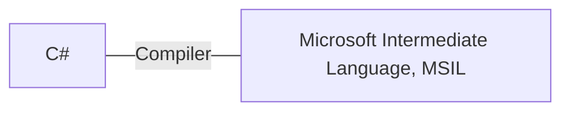
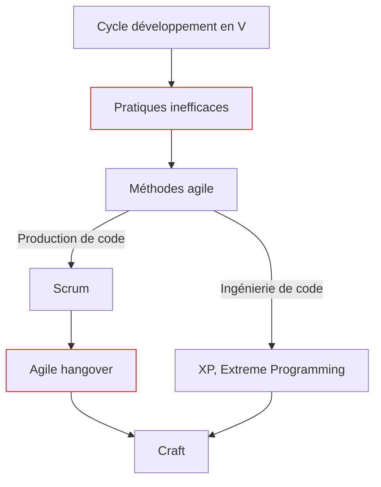
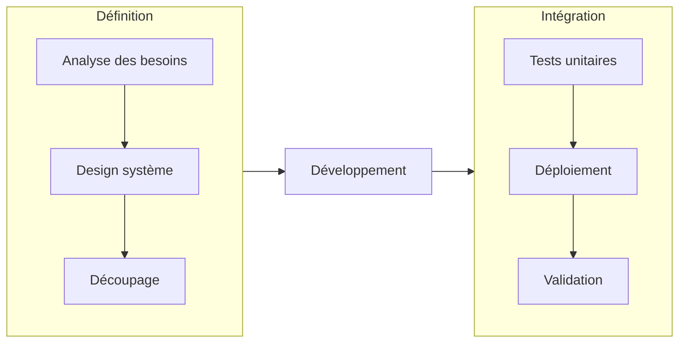
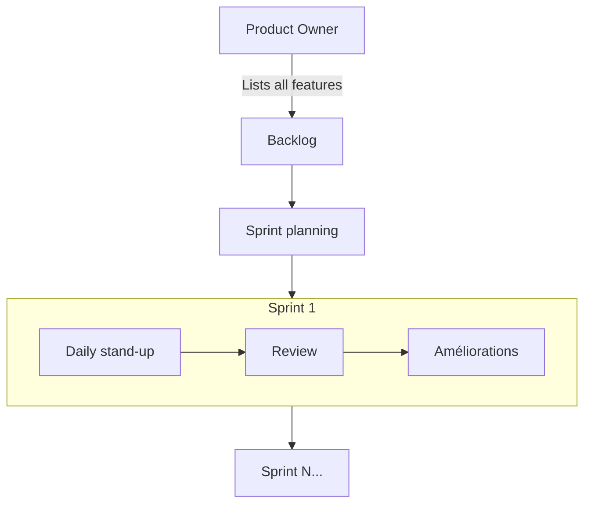
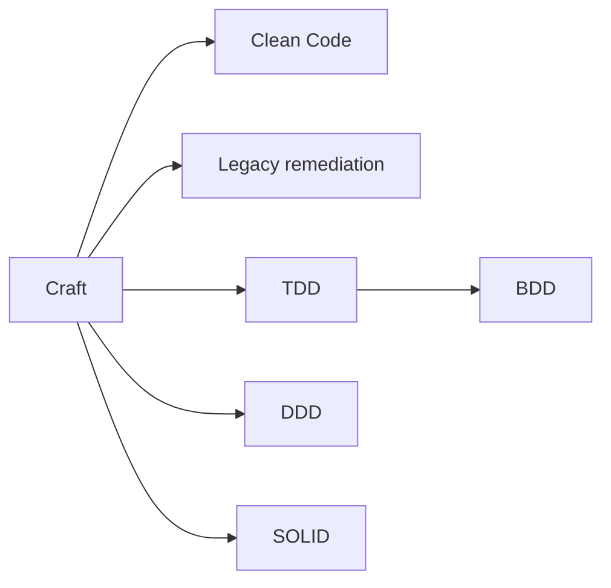
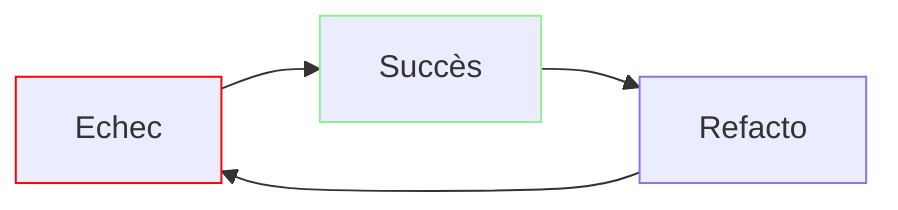
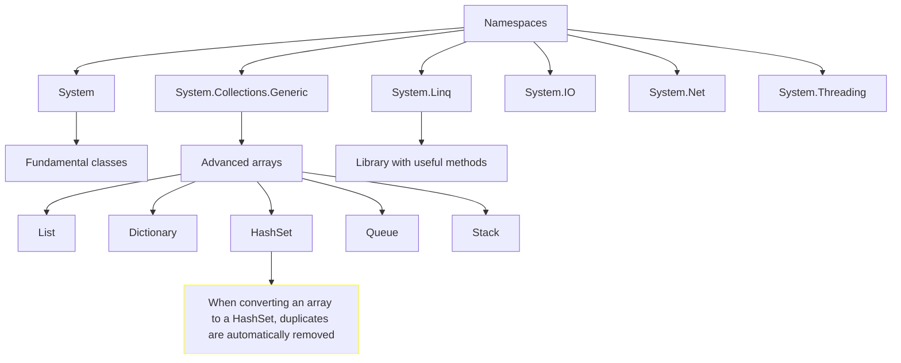

# C# Fundamentals

Source: [Microsoft](https://learn.microsoft.com/en-gb/training/)

## Table of contents

<!--TOC-->
- [First C# code](#first-c-code)
  - [Introduction](#introduction)
  - [Challenge 1: printing on console](#challenge-1-printing-on-console)
  - [Variables](#variables)
    - [Data types](#data-types)
    - [Implicitly typed local variables](#implicitly-typed-local-variables)
    - [Challenge 2: typed variables](#challenge-2-typed-variables)
    - [Character escape sequences](#character-escape-sequences)
    - [String interpolation](#string-interpolation)
    - [Challenge 3: string interpolation](#challenge-3-string-interpolation)
    - [Type casting](#type-casting)
    - [Challenge 4: operations](#challenge-4-operations)
  - [Project 1 : calculate average and query list](#project-1-calculate-average-and-query-list)
  - [Project 2 : calculate GPA](#project-2-calculate-gpa)
- [Exercism](#exercism)
  - [Basics](#basics)
  - [Booleans](#booleans)
  - [Strings](#strings)
    - [Substring](#substring)
    - [Regex](#regex)
  - [Numbers](#numbers)
  - [Extended methods](#extended-methods)
  - [Tuples](#tuples)
    - [Dictionary](#dictionary)
  - [Nullability](#nullability)
  - [While](#while)
    - [Do While](#do-while)
  - [Class](#class)
    - [Encapsulation](#encapsulation)
- [Software craft](#software-craft)
  - [Intro](#intro)
  - [Historique](#historique)
    - [V-model](#v-model)
    - [Méthode agile](#methode-agile)
    - [Scrum](#scrum)
    - [XP (Extreme programming)](#xp-extreme-programming)
    - [Agile hangover](#agile-hangover)
    - [Craft](#craft)
  - [Test-driven development (TDD)](#test-driven-development-tdd)
    - [Nommage](#nommage)
    - [Arrange Act Assert](#arrange-act-assert)
    - [Exemple FizzBuzz](#exemple-fizzbuzz)
    - [Red phase](#red-phase)
    - [Green phase](#green-phase)
    - [Final code](#final-code)
- [General knowledge](#general-knowledge)
  - [Git](#git)
  - [32-bit (x86), 64-bit (x64)](#32-bit-x86-64-bit-x64)
  - [Exception handling](#exception-handling)
    - [Understanding stack tracing](#understanding-stack-tracing)
  - [Namespaces](#namespaces)
  - [Glossary](#glossary)
  - [Variables](#variables)
    - [Primitive types: numeric](#primitive-types-numeric)
    - [Type casting](#type-casting)
    - [Primitive types: strings](#primitive-types-strings)
    - [Constants](#constants)
<!--/TOC-->

# First C# code

## Introduction

C# is a case-sensitive language.

`console` is different from `Console`.

Interpreting error messages is key:

```c#
console.WriteLine("i like ice cream");
```
```terminal
(1,1): error CS0103: The name 'console' does not exist in the current context
```




| Term | Definition | Example |
| --- | --- | --- |
| literal string | data is output literally | `"hello world"` |
| class | a class is an object, having methods live within it | `Console` |
| method | each method has one job; they live within classes | `WriteLine()` |

## Challenge 1: printing on console

```c#
Console.WriteLine("This is the first line.");
Console.Write("This is the second line.");
Console.Write("This is the third line.");
```
```terminal
This is the first line.
This is the second line.This is the third line.
```

## Variables

### Data types

Data typing is a key characteristic of C#: designers believed it can lead to avoiding common bugs.

| Data type | Use case | Example |
| --- | --- | --- |
| string | presentation or text manipulation | `string myString = "Hello";` |
| char | presentation or text manipulation | `char myChar = 'A';` |
| int | calculation | `int myInt = 10;` |
| float | calculation (6-9 digits) | `float mySmallNumber = 3.14f;` |
| double | calculation (15-17 digits; default in C#, no literal suffix needed) | `double myMediumNumber = 3.14;` |
| decimal | calculation (28-29 digits) | `decimal myLargeNumber = 3.14m;` |
| bool | evaluation | `bool myBool = true;` |

### Implicitly typed local variables

Use the `var` keyword: it tells the compiler that data type is implied.

```c#
var message = "hello world";
```

You can use `var` when the data type is not known.

However, it's best practice to always type your variables.

`/!\` C# always attributes a data type to a variable, even if implicit.

### Challenge 2: typed variables

```c#
string userName = "Bob";
int messageNumber = 3;
float temperature = 34.4f;

Console.WriteLine($"Hello, {userName}!");
Console.Write($"You have {messageNumber} messages in your inbox. The temperature is {temperature} celsius.");
```

```terminal
Hello, Bob!
You have 3 messages in your inbox. The temperature is 34.4 celsius.
```

### Character escape sequences

| Sequence | Description |
| --- | --- |
| `\n` | new line |
| `\t` | tab |
| `\"` | escape double-quotes |
| `\\` | escape back slashes |
| `@` | output verbatim (as is); keep whitespaces |

### String interpolation

```c#
string one = "hello";
string two = "world";
Console.Write($"{one} {two}");
```

```terminal
hello world
```

```c#
string projectName = "helloWorld";
Console.Write($@"C:\Output\{projectName}\Data");
```

```terminal
C:\Output\helloWorld\Data
```

### Challenge 3: string interpolation

```c#
string englishMessage = "View English output:";
string projectName = "ACME";
string englishProjectLocation = $@"c:\Exercise\{projectName}\data.txt";

Console.WriteLine($"{englishMessage}\n\t{englishProjectLocation}\n");

string russianMessage = "\u041f\u043e\u0441\u043c\u043e\u0442\u0440\u0435\u0442\u044c \u0440\u0443\u0441\u0441\u043a\u0438\u0439 \u0432\u044b\u0432\u043e\u0434";
string russianProjectLocation = $@"c:\Exercise\{projectName}\ru-RU\data.txt";

Console.WriteLine($"{russianMessage}\n\t{russianProjectLocation}\n");
```

```terminal
View English output:
	c:\Exercise\ACME\data.txt

Посмотреть русский вывод
	c:\Exercise\ACME\ru-RU\data.txt
```

### Type casting

Make a variable **pretend** to be a different type (within a sort of computed calculation):

```c#
int a = 10;
int b = 4;
double c = a / (double) b;
```

### Challenge 4: operations

```c#
int fahrenheit = 94;
float celsius = (fahrenheit - 32) * (5/9f);
Console.Write($"The temperature is {Math.Round(celsius, 1)} Celsius.");
```

```terminal
The temperature is 34.4 Celsius.
```

## Project 1 : calculate average and query list

```c#
// grades
int[] sophia = {93, 87, 98, 95, 100};
int[] nicolas = {80, 83, 82, 88, 85};
int[] zahirah = {84, 96, 73, 85, 79};
int[] jeong = {90, 92, 98, 100, 97};

// Averages
float sophiaAverage = (float) sophia.Sum() / sophia.Length;
float nicolasAverage = (float) nicolas.Sum() / nicolas.Length;
float zahirahAverage = (float) zahirah.Sum() / zahirah.Length;
float jeongAverage = (float) jeong.Sum() / jeong.Length;

// Grading
List<(int, int, string)> grades = new List<(int, int, string)> {
    (97, 100, "A+"),
    (93, 96, "A"),
    (90, 92, "A-"),
    (87, 89, "B+"),
    (83, 86, "B")
};

// List with results
List<(string, float, string)> results = new List<(string, float, string)> {
    ("Sophia", sophiaAverage, grades.FirstOrDefault(g => sophiaAverage >= g.Item1 && sophiaAverage <= g.Item2).Item3),
    ("Nicolas", nicolasAverage, grades.FirstOrDefault(g => nicolasAverage >= g.Item1 && nicolasAverage <= g.Item2).Item3),
    ("Zahirah", zahirahAverage, grades.FirstOrDefault(g => zahirahAverage >= g.Item1 && zahirahAverage <= g.Item2).Item3),
    ("Jeong", jeongAverage, grades.FirstOrDefault(g => jeongAverage >= g.Item1 && jeongAverage <= g.Item2).Item3),
};

Console.WriteLine(string.Join("\n", results));
```

```terminal
(Sophia, 94.6, A)
(Nicolas, 83.6, B)
(Zahirah, 83.4, B)
(Jeong, 95.4, A)
```

## Project 2 : calculate GPA

```c#
List<(string, int, int)> finalGrades = new List<(string, int, int)> {
("English 101", 4, 3),
("Algebra 101", 3, 3),
("Biology 101", 3, 4),
("Computer Science 101", 3, 4),
("Pyschology 101", 4, 3)
};

var credits = finalGrades.Select(g => g.Item2).ToArray();
var grades = finalGrades.Select(g => g.Item3).ToArray();

int[] results = new int[credits.Length];
for (int i = 0; i < results.Length; i++) {
    results[i] = credits[i] * grades[i];
}

float gpa = (results.Sum() / (float) credits.Sum());
gpa = (float)Math.Round(gpa, 2);

Console.Write(gpa);
```

# Exercism

## Basics

C# is a statically-typed language:

```c#
int explicitVar = 10; // Explicitly typed
var implicitVar = 10; // Implicitly typed
```

And an object-oriented language where functions are defined in classes.

Classes need to be instantiated using `new`:

```C#
class Calculator
{
    // ...
}

var calculator = new Calculator();
```

Classes group methods, whose parameters and return values need to be explicitly typed.

`public` allows a method to be called by code in other files.

```c#
class Calculator
{
    public int Add(int x, int y)
    {
        return x + y;
    }
}
```

Comments can be single line `//` or multiline `/* */`.

## Booleans

Type `bool`.

Operators `!` (NOT), `&&` (AND), and `||` (OR).

## Strings

### Substring

```c#
public static string Message(string logLine)
    {
        int first = logLine.IndexOf(":") + ":".Length;
        int last = logLine.Length;
        return logLine.Substring(first, last - first).Trim();
    }
```

```terminal
LogLine.Message("[ERROR]: Invalid operation")
// => "Invalid operation"
```

### Regex

```c#
public static string LogLevel(string logLine)
    {
        Regex rx = new Regex("\\[(.*)\\]");
        MatchCollection matches = rx.Matches(logLine);
        return matches[0].Groups[1].Value.ToLower();
    }
```

```terminal
// "[ERROR]: Disk full"
error
```

## Numbers

Digit separator:

```c#
int largeInt = 1_000_000;
// => 1000000

double largeDouble = 9_876_543.21;
// => 9876543.21
```

## Extended methods

```c#
// TODO: define the 'SubstringAfter()' extension method on the `string` type
    public static string SubstringAfter(this string str, string input) {
        return str.Split(input)[1];
    }
    // TODO: define the 'SubstringBetween()' extension method on the `string` type
    
    public static string SubstringBetween(this string str, string input1, string input2) {
        return str.Split(input1)[1].Split(input2)[0];
    }
    
    // TODO: define the 'Message()' extension method on the `string` type
    public static string Message(this string str) {
        return str.SubstringAfter("]:").Trim();
    }
    // TODO: define the 'LogLevel()' extension method on the `string` type
    public static string LogLevel(this string str) {
        return str.SubstringBetween("[", "]");
    }
```

```c#
public static class Bob
{
    // Check if string is uppercase
    private static bool IsUpperCase(this string statement) =>
        statement.Any(char.IsLetter) &&
        statement.All(e => !char.IsLetter(e) || char.IsUpper(e));

    // Check if string ends with ?
    private static bool IsQuestion(this string statement) => statement.Trim().EndsWith("?");
    
    public static string Response(string statement)
    {
        if (statement.IsQuestion() && statement.IsUpperCase()) {
            return "Calm down, I know what I'm doing!";
        }
    
        if (statement.IsQuestion()) {
            return "Sure.";
        }
    
        if (statement.IsUpperCase()) {
            return "Whoa, chill out!";
        }
    
        if (string.IsNullOrWhiteSpace(statement)) {
            return "Fine. Be that way!";
        }
            
        return "Whatever.";
    }
}
```

## Tuples

```c#
string boast = "All you need to know";
bool success = !string.IsNullOrWhiteSpace(boast);
(bool, int, string) triple = (success, 42, boast);
```

```c#
// Change tuple field names

// Name items in declaration
(bool success, string message) results = (true, "well done!");
bool mySuccess = results.success;
string myMessage = results.message;

// Name items in creating expression
var results2 = (success: true, message: "well done!");
bool mySuccess2 = results2.success;
string myMessage2 = results2.message;
```

```c#
public static class PhoneNumber
{
    private static string IsSplit(this string phoneNumber, int index) {
        return phoneNumber.Split("-")[index];
    }
    
    public static (bool IsNewYork, bool IsFake, string LocalNumber) Analyze(string phoneNumber)
    {
        return ((phoneNumber.IsSplit(0) == "212"), phoneNumber.IsSplit(1) == "555", phoneNumber.IsSplit(2));
    }

    public static bool IsFake((bool IsNewYork, bool IsFake, string LocalNumber) phoneNumberInfo) => phoneNumberInfo.IsFake;
}
```

### Dictionary

```c#
public static class ScrabbleScore
{
    public static int Score(string input)
        {
            List<(string, int)> tuples = new()
            {
                ("aeioulnrst", 1),
                ("dg", 2),
                ("bcmp", 3),
                ("fhvwy", 4),
                ("k", 5),
                ("jx", 8),
                ("qz", 10)
            };

            Dictionary<char, int> dictionary = new();

            foreach (var tuple in tuples)
            {
                foreach (char c in tuple.Item1)
                {
                    dictionary[c] = tuple.Item2;
                }
            }

            int count = 0;

            char[] charArray = input.ToLower().ToArray();

            foreach (char c in charArray)
            {
                count += dictionary[c];
            }
        
        return count;
    }
}
```

## Nullability

```c#
public static string Print(int? id, string name, string? department)
    {
        
        if (!id.HasValue && string.IsNullOrEmpty(department)) {
            return $"{name} - OWNER";
        }
        
        if (!id.HasValue) {
            return $"{name} - {department.ToUpper()}"; 
        }

        if (string.IsNullOrEmpty(department)) {
            return $"[{id}] - {name} - OWNER";
        }
        
        return $"[{id}] - {name} - {department.ToUpper()}";
    }
```

## While

```c#
int x = 23;

while (x > 10)
{
    // Execute logic if x > 10
    x = x - 2;
}
```

### Do While
```c#
int x = 23;

// Execute at least once, then loop
do
{
    // Execute logic if x > 10
    x = x - 2;
} while (x > 10)
```

## Class

Primary C# object-oriented construct.

Combination of fields (data) and methods (behaviors): members.

Access to members (fields and methods) is restricted using access modifiers: 

| Access modifier | Description |
| --- | --- |
| public | No restrictions. |
| private | Access only by code in same class. |

```c#
Class Car
{

    // This is accessible by anyone.
    // Public fields use PascalCase (you can use camelCase).
    public int carWeight;

    // This is only accessible by code in the class.
    // Private fields use _camelCase.
    private string _carColor;

}

// Create an object of the Car class
var oneCar = new Car();
```

```c#
class CarImporter
{
    private int _carsImported;

    // Use void to calculate without a return statement.
    public void ImportCars(int numberOfCars)
    {
        _carsImported = _carsImported + numberOfCars;
    }
}
```

### Encapsulation

```c#
private int _distance;

public int Distance
{
    get
    {
        return _distance;
    }
    set
    {
        _distance += value;
    }
}
```

Encapsulation is a fundamental concept in object-oriented programming: **it allows to expose fields safely**.

You hide the internal state of an object and control how that state is modified.

In this case, the _distance field is private, which means it can't be accessed directly from outside the class. 

Instead, you provide a public property Distance that allows external code to get and set the value of _distance.

# Software craft

## Intro

Le software craft, c'est un ensemble d'attitudes, de réflexes pragmatiques.

C'est redéfinir ce qu'est un "bon" logiciel :

- Un logiciel qui marche, c'est le strict minimum : *le vrai enjeu du développement logiciel est de rester évolutif dans la durée, ajouter et modifier facilement des fonctionnalités existantes.*
- Un logiciel n'est jamais fini, à moins qu'il soit en fin de vie : le code doit donc être le plus plastique possible.
- Le code est plus lu qu'écrit : il faut donc privilégier une écriture simple.
- Les problèmes complexes ne peuvent tenir *en une seule tête* : il est important de poser des questions.

*Les compétences en software craft deviennent désirables voire requises en développement logiciel.*

## Historique



### V-model

Modèle de développement logiciel traditionnel devenu rigide vers la fin des années 1990.

Critiques principales :

- Cycle trop linéaire manquant des itérations.
- Ce qui le rend rigide face à des besoins de moins en moins précis.
- Les tests sont effectués trop tard dans le cycle.
- Ce qui fait que revenir en arrière devient compliqué.



### Méthode agile

Modèle en réaction à la rigidité du V-model, découpant le développement en sprints par feature.

Avantages :

- Feedback plus régulier, permettant d'ajuster.
- Livraison de features opérationnelles petit à petit.
- La livraison par feature permet d'identifier des problèmes en cours de développement et non à la fin.



### Scrum

*Scrum is one framework of the Agile philosophy.*

Dans Scrum, un Scrum master sert d'intermédiaire entre le PO et les développeurs.

Il assure également le bon déroulement des processus et des sprints.

Des outils spécifiques sont également mis en place : product backlog, sprint backlog, burndown charts (work to do vs time), etc.

### XP (Extreme programming)

XP est également une implémentation d'Agile, focalisée sur la qualité du code produit.

On y ajoute du pair programming, du test-driven development (TDD), de l'intégration continue (CI), des pratiques de refactorisation, etc.

### Agile hangover

L'arivée des méthodes Agile a permis de surmonter le problème de rigidité posé par les méthodes de développement traditionnelles (V-model). 

Scrum est devenu populaire et les équipes ont gagné en efficacité de production de code.

Cependant, cela a créé un autre problème : en l'absence de bonnes pratiques d'ingénierie de code, le code produit est devenu difficile à entretenir.

Robert C. Martin (uncle Bob) a relancé la mouvance XP pour rappeler l'importance des pratiques de code.

Le Craft est apparu comme une boîte à outils de techniques encourageant la production de code propre.

### Craft



## Test-driven development (TDD)

- Ecrire des tests avant ou en parallèle du code de production :
    - Fixer l'objectif du besoin.
    - Définir les comportements attendus.
    - Ecrire le moins de code possible pour satisfaire ces comportements attendus.

- Trois règles :
    1. Ecrire un test qui échoue avant tout écriture de code.
    2. Ne pas écrire plus de tests que nécessaire.
    3. N'écrire que le code suffisant à passer les tests.

- Chaque itération se décline en trois étapes : rouge (échec) -> green (succès) -> refacto



### Nommage

should/when

```terminal
Method_should_do_this_when_this
```

given/when/then
```terminal
Given_x_when_I_do_x_then_x_happens
```

```c#
Namespaces, classes, methods: PascalCase;
Public variables: camelCase;
Private variables: m_camelCase;
Test methods: MethodTested_Scenario_ExpectedOutcome
```

### Arrange Act Assert

Préparer Agir Vérifier

- Commencer par la vérification (assert).
- Puis écrire l'action (act).
- Puis initialiser les variables à tester (arrange).

### Exemple FizzBuzz

```terminal
Voir le TDD comme l'écriture d'un kata.
```

- Objectif :
    - Ecrire un programme qui permette, de 1 à 100, afficher :

```terminal
"Fizz" si multiple de 3,
"Buzz" si multiple de 5,
"FizzBuzz", si multiple de 3 et 5,
le nombre lui-même autrement.
```

- Exemples :
    - Aller du plus simple au plus complexe :

```terminal
Si n = 1, "1",
Si n = 3, "Fizz",
Si n = 5, "Buzz",
Si n = 15, "FizzBuzz".
```

```c#
namespace FizzBuzz
{
    public class Program
    {
        public static void Test()
        {
            Console.WriteLine("hello");
        }

        public static void Main()
        {
            Test();
        }
    }
}
```

```terminal
Right-click > Créer des tests unitaires
```

```c#
namespace FizzBuzzTests
{
    [TestClass]
    public class ProgramTests
    {
        [TestMethod]
        public void TestTest()
        {
            Assert.Fail();
        }
    }
}
```

### Red phase

```c#
namespace FizzBuzz
{
    public class Program
    {
        public string Print(int number)
        {
            throw new NotImplementedException();
        }

        public static void Main()
        {

        }
    }
}
```

```c#
namespace FizzBuzzTests
{
    [TestClass]
    public class ProgramTests
    {
        [TestMethod]
        public void Should_return_same_number_when_not_multiple_of_three_or_five()
        {
            Program fizzBuzz = new();
            int number = 1;
            string value = fizzBuzz.Print(number);
            Assert.AreEqual("1", value);
        }
    }
}
```

```terminal
La méthode de test FizzBuzzTests.ProgramTests.Should_return_same_number_when_not_multiple_of_three_or_five a levé une exception : 
System.NotImplementedException: The method or operation is not implemented.
```

### Green phase

```c#
namespace FizzBuzz
{
    public class Program
    {
        public string Print(int number)
        {
            return number.ToString();
        }

        public static void Main()
        {

        }
    }
}
```

### Final code

```c#
public class Program
    {
        private bool IsMultipleOf(int number, int divider)
        {
            return number % divider == 0;
        }
        
        public string Print(int number)
        {

            string fizzBuzzValue = null;
            
            if (IsMultipleOf(number, 3))
            {
                fizzBuzzValue += "Fizz";
            }
            
            if (IsMultipleOf(number, 5))
            {
                fizzBuzzValue += "Buzz";
            }

            if (fizzBuzzValue != null)
            {
                return fizzBuzzValue;
            }
            
            return number.ToString();
        }

        public static void Main()
        {
            Program test = new Program();
            Random random = new Random();
            int number = random.Next(1, 101);
            string result = test.Print(number);
            Console.WriteLine($"{number} {result}");
        }
    }
```

```c#
[TestClass]
    public class ProgramTests
    {
        private Program fizzBuzz;
        private int number;
        private string value;
        
        [TestInitialize]
        public void TestArrange()
        {
            fizzBuzz = new Program();
        }
        
        [TestMethod]
        public void Should_return_same_number_when_not_multiple_of_three_or_five()
        {
            // Arrange
            number = 1;
            
            // Act
            value = fizzBuzz.Print(number);
            
            // Assert
            Assert.AreEqual("1", value);
        }

        [TestMethod]
        public void Should_return_fizz_when_multiple_of_three()
        {
            number = 3;
            value = fizzBuzz.Print(number);
            Assert.AreEqual("Fizz", value);
        }

        [TestMethod]
        public void Should_return_buzz_when_multiple_of_five()
        {
            number = 5;
            value = fizzBuzz.Print(number);
            Assert.AreEqual("Buzz", value);
        }

        [TestMethod]
        public void Should_return_fizzbuzz_when_multiple_of_three_and_five()
        {
            number = 15;
            value = fizzBuzz.Print(number);
            Assert.AreEqual("FizzBuzz", value);
        }
    }
```

[Troubleshooting](https://learn.microsoft.com/en-us/visualstudio/test/unit-test-basics?view=vs-2022)

# General knowledge

## Git

| Command | Description |
| --- | --- |
| Add | New code or feature. |
| Update | Changes to existing. |
| Fix | Bug correction. |
| Remove | Deletion. |
| Refactor | Changes not affecting functionality. |
| Document | Comments or documentation. |
| Merge | Code combination. |
| Revert | Undo changes. |

## 32-bit (x86), 64-bit (x64) 

In a nutshell, 16 (1978) -> 32 (1985) -> 64-bit (2003).

32-bit `int`: range from -2,147,483,648 to 2,147,483,647.

64-bit `int`: range from -9,223,372,036,854,775,808 to 9,223,372,036,854,775,807.

> The transition to 64-bit computing was indeed significant for handling complex data. The 64-bit architecture provides a larger address space, which means it can access more memory and handle larger data sets more efficiently. This is particularly beneficial for applications that require high-performance computing or are data-intensive, such as databases, scientific simulations, and video encoding. However, for many everyday applications, the difference between 32-bit and 64-bit might not be noticeable.


| Term | Acronym | Description | Extension |
| --- | --- | --- | --- |
| Access | | MS-provided relational DB manager like mySQL for small, end-user oriented projects. | .mdb |
| OLEDB | Object Linking and Embedding Database | MS API for accessing data. | |

## Exception handling

```c#
public static void Main()
{
    int[] arr = { 1, 2, 3, 4, 5 };
    Console.WriteLine(arr[5]); // Error here <- You get an error message.

    // Unhandled exception
    // System.IndexOutOfRangeException : 'Index was outside the bounds of the array.'
}
```

```c#
public static void Main()
{
    int[] arr = { 1, 2, 3, 4, 5 };
    Console.WriteLine(arr[5]); // Error <- The program will terminate here since no error handler.
    Console.WriteLine(arr[4]); // 5 <- This line will not be reached.
}
```

```c#
public static void Main()
{
    int[] arr = { 1, 2, 3, 4, 5 };

    try
    {
        // Potentially error-prone code.
        Console.WriteLine(arr[5]);
    }

    catch (Exception ex)
    {
        // Error handler.
        Console.WriteLine(ex.ToString());

        // System.IndexOutOfRangeException: Index was outside the bounds of the array.
        // at ConsoleApp1.Program.Main() in C:\Users\steven.jimenez\source\repos\ConsoleApp1\Program.cs:line 11

    }

    Console.WriteLine(arr[4]); // 5 <- This line will now be reached.
}
```

```c#
catch (Exception ex)
{
    Console.WriteLine(ex.ToString());

    // System.IndexOutOfRangeException: Index was outside the bounds of the array.
    // at ConsoleApp1.Program.Main() in C:\Users\steven.jimenez\source\repos\ConsoleApp1\Program.cs:line 11

    Console.WriteLine(ex.GetType());

    // System.IndexOutOfRangeException

    Console.WriteLine(ex.Message);

    // Index was outside the bounds of the array.

    Console.WriteLine(ex.StackTrace);

    // at ConsoleApp1.Program.Main() in C:\Users\steven.jimenez\source\repos\ConsoleApp1\Program.cs:line 11
}
```

```c#
public static void Main()
{
    int[] arr = { 1, 2, 3, 4, 5 };

    try
    {
        // Potentially error-prone code.
        Console.WriteLine(arr[5]);
    }

    catch (Exception ex)
    {
        // Error handler.
        Console.WriteLine(ex.ToString());

    }
    finally
    {
        Console.WriteLine("Code always executed."); // This line will always be reached.
        // Usually used to close or clean up resources used in the try block
        // (files, connections, etc.).
    }

    Console.WriteLine(arr[4]); // This line will also be reached.
}
```

```c#
private static void CheckAge(int age)
{
    if (age < 18)
    {
        Console.WriteLine("Access denied"); // This way of signaling an error can't keep track of its trace.
        // For better debugging, declare an error condition.
    }
    else
    {
        Console.WriteLine("Adult.");
    }
}
        
public static void Main()
{
    CheckAge(15);
}
```

```c#
private static void CheckAge(int age)
{
    if (age < 18)
    {
        throw new Exception("Access denied"); // This will terminate the program, since there is no catch block.
    }
    else
    {
        Console.WriteLine("Adult.");
    }
}
        
public static void Main()
{
    CheckAge(15);
}
```

```c#
private static void CheckAge(int age)
{
    try
    {

        if (age < 18)
        {
            throw new Exception("Access denied.");
        }
        else
        {
            Console.WriteLine("Adult.");
        }

    }

    catch (Exception ex)
    {
        Console.WriteLine(ex.Message); // This will catch the error and log it (keeping a trace).
    }
}
        
public static void Main()
{
    CheckAge(15); // Access denied.
    CheckAge(21); // Adult. <- This line will now be reached.
}
```

### Understanding stack tracing

```c#
private static void MethodA()
{
    MethodB();
}
private static void MethodB()
{
    throw new Exception("Error here.");
}

public static void Main()
{
    try
    {
        MethodA();
    }
            
    catch (Exception ex)
    {
        Console.WriteLine(ex.StackTrace);
        // at ConsoleApp1.Program.MethodB() in C:\Users\steven.jimenez\source\repos\ConsoleApp1\Program.cs:line 11
        // at ConsoleApp1.Program.MethodA() in C:\Users\steven.jimenez\source\repos\ConsoleApp1\Program.cs:line 7
        // at ConsoleApp1.Program.Main() in C:\Users\steven.jimenez\source\repos\ConsoleApp1\Program.cs:line 18
    }
}
```

```c#

private static void MethodA()
{
    MethodB();
}
private static void MethodB()
{
    throw new Exception("Error here.");
}
private static void MethodC()
{
    Console.WriteLine("You reached me!");
}

public static void Main()
{
    try
    {
        MethodA();
    }

    catch (Exception ex)
    {
        Console.WriteLine(ex.Message); // Error here.
    }

    MethodC(); // You reached me!
}
```

## Namespaces

In C#, like in other languages, `namespaces` are containers that group similar classes, interfaces, functions and other code.



## Glossary

<!--| Term | Definition | Example |
| --- | --- | --- |
| compiler | *converts your code from a human higher-level language (C#) into an executable format that the computer can understand.* | x |
| precompilation | process before the main compilation process to help with performance | red squiggly lines underlining the code that will produce an error |
| programming language | *A programming language's job is to allow a human to express their intent [to a computer] in a human-readable and understandable way.* |
| syntax | rules for writing code | X |
----->

## Variables

| Category | Type | Example |
| --- | --- | --- |
| Value | int | `int myInt = 10;` |
| Value | float | `float myFloat = 3.14f;` |
| Value | bool | `bool myBool = true;` |
| Value | char | `char myChar = 'A';` |
| Reference | string | `string myString = "Hello";` |
| Reference | array | `int[] myArray = new int[5];` |
| Reference | class | `MyClass myObject = new MyClass();` |

Using specific types can help optimize CPU memory allocation when running a program.

### Primitive types: numeric

```c#
int count = 10;

// 6-9 digits; uses the "f" literal
float length = 1876.79f;

// 15-17 digits; default in C#
double width = 1876.79797657;

// 28-29 digits; uses the "m" literal
decimal cost = 300.5m; 
```

Decimal types are more memory-intensive.

### Type casting

Make a variable **pretend** to be a different type (within a sort of computed calculation):

```c#
int a = 10;
int b = 4;
double c = a / (double) b;
```

### Primitive types: strings

```c#
string favoriteCity = "Buenos Aires";
int numberOfTrips = 5;

string story = "I've traveled to " + favoriteCity + " " + numberOfTrips + " times!"; // -> "I've traveled to Buenos Aires 5 times!"
```

### Constants

*It's recommended to use constants whenever possible*: they allow programs to go faster (not check for alternative values):

```c#
const int numberOfWeekdays = 7;
```