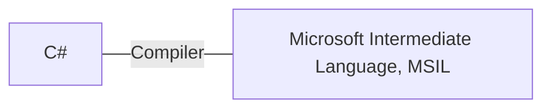
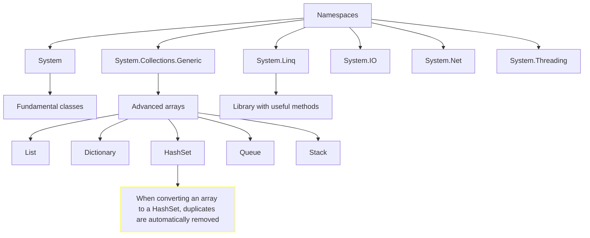

# C# Fundamentals

Source: [Microsoft](https://learn.microsoft.com/en-gb/training/)

## Table of contents

- [C# Fundamentals](#c-fundamentals)
  - [Table of contents](#table-of-contents)
  - [Introduction](#introduction)
  - [Challenge 1: printing on console](#challenge-1-printing-on-console)
  - [Variables](#variables)
    - [Data types](#data-types)
    - [Implicitly typed local variables](#implicitly-typed-local-variables)
    - [Challenge 2: typed variables](#challenge-2-typed-variables)
    - [Character escape sequences](#character-escape-sequences)
    - [String interpolation](#string-interpolation)
    - [Challenge 3: string interpolation](#challenge-3-string-interpolation)
    - [Type casting](#type-casting)
    - [Challenge 4: operations](#challenge-4-operations)
  - [Project 1 : calculate average and query list](#project-1--calculate-average-and-query-list)
  - [Namespaces](#namespaces)
  - [Glossary](#glossary)
  - [| syntax | rules for writing code |](#-syntax--rules-for-writing-code-)
  - [Variables](#variables-1)
    - [Primitive types: numeric](#primitive-types-numeric)
    - [Type casting](#type-casting-1)
    - [Primitive types: strings](#primitive-types-strings)
    - [Constants](#constants)

## Introduction

C# is a case-sensitive language.

`console` is different from `Console`.

Interpreting error messages is key:

```c#
console.WriteLine("i like ice cream");
```
```terminal
(1,1): error CS0103: The name 'console' does not exist in the current context
```




| Term | Definition | Example |
| --- | --- | --- |
| literal string | data is output literally | `"hello world"` |
| class | a class is an object, having methods live within it | `Console` |
| method | each method has one job; they live within classes | `WriteLine()` |

## Challenge 1: printing on console

```c#
Console.WriteLine("This is the first line.");
Console.Write("This is the second line.");
Console.Write("This is the third line.");
```
```terminal
This is the first line.
This is the second line.This is the third line.
```

## Variables

### Data types

Data typing is a key characteristic of C#: designers believed it can lead to avoiding common bugs.

| Data type | Use case | Example |
| --- | --- | --- |
| string | presentation or text manipulation | `string myString = "Hello";` |
| char | presentation or text manipulation | `char myChar = 'A';` |
| int | calculation | `int myInt = 10;` |
| float | calculation (6-9 digits) | `float mySmallNumber = 3.14f;` |
| double | calculation (15-17 digits; default in C#, no literal suffix needed) | `double myMediumNumber = 3.14;` |
| decimal | calculation (28-29 digits) | `decimal myLargeNumber = 3.14m;` |
| bool | evaluation | `bool myBool = true;` |

### Implicitly typed local variables

Use the `var` keyword: it tells the compiler that data type is implied.

```c#
var message = "hello world";
```

You can use `var` when the data type is not known.

However, it's best practice to always type your variables.

`/!\` C# always attributes a data type to a variable, even if implicit.

### Challenge 2: typed variables

```c#
string userName = "Bob";
int messageNumber = 3;
float temperature = 34.4f;

Console.WriteLine($"Hello, {userName}!");
Console.Write($"You have {messageNumber} messages in your inbox. The temperature is {temperature} celsius.");
```

```terminal
Hello, Bob!
You have 3 messages in your inbox. The temperature is 34.4 celsius.
```

### Character escape sequences

| Sequence | Description |
| --- | --- |
| `\n` | new line |
| `\t` | tab |
| `\"` | escape double-quotes |
| `\\` | escape back slashes |
| `@` | output verbatim (as is); keep whitespaces |

### String interpolation

```c#
string one = "hello";
string two = "world";
Console.Write($"{one} {two}");
```

```terminal
hello world
```

```c#
string projectName = "helloWorld";
Console.Write($@"C:\Output\{projectName}\Data");
```

```terminal
C:\Output\helloWorld\Data
```

### Challenge 3: string interpolation

```c#
string englishMessage = "View English output:";
string projectName = "ACME";
string englishProjectLocation = $@"c:\Exercise\{projectName}\data.txt";

Console.WriteLine($"{englishMessage}\n\t{englishProjectLocation}\n");

string russianMessage = "\u041f\u043e\u0441\u043c\u043e\u0442\u0440\u0435\u0442\u044c \u0440\u0443\u0441\u0441\u043a\u0438\u0439 \u0432\u044b\u0432\u043e\u0434";
string russianProjectLocation = $@"c:\Exercise\{projectName}\ru-RU\data.txt";

Console.WriteLine($"{russianMessage}\n\t{russianProjectLocation}\n");
```

```terminal
View English output:
	c:\Exercise\ACME\data.txt

Посмотреть русский вывод
	c:\Exercise\ACME\ru-RU\data.txt
```

### Type casting

Make a variable **pretend** to be a different type (within a sort of computed calculation):

```c#
int a = 10;
int b = 4;
double c = a / (double) b;
```

### Challenge 4: operations

```c#
int fahrenheit = 94;
float celsius = (fahrenheit - 32) * (5/9f);
Console.Write($"The temperature is {Math.Round(celsius, 1)} Celsius.");
```

```terminal
The temperature is 34.4 Celsius.
```

## Project 1 : calculate average and query list

```c#
// grades
int[] sophia = {93, 87, 98, 95, 100};
int[] nicolas = {80, 83, 82, 88, 85};
int[] zahirah = {84, 96, 73, 85, 79};
int[] jeong = {90, 92, 98, 100, 97};

// Averages
float sophiaAverage = (float) sophia.Sum() / sophia.Length;
float nicolasAverage = (float) nicolas.Sum() / nicolas.Length;
float zahirahAverage = (float) zahirah.Sum() / zahirah.Length;
float jeongAverage = (float) jeong.Sum() / jeong.Length;

// Grading
List<(int, int, string)> grades = new List<(int, int, string)> {
    (97, 100, "A+"),
    (93, 96, "A"),
    (90, 92, "A-"),
    (87, 89, "B+"),
    (83, 86, "B")
};

// List with results
List<(string, float, string)> results = new List<(string, float, string)> {
    ("Sophia", sophiaAverage, grades.FirstOrDefault(g => sophiaAverage >= g.Item1 && sophiaAverage <= g.Item2).Item3),
    ("Nicolas", nicolasAverage, grades.FirstOrDefault(g => nicolasAverage >= g.Item1 && nicolasAverage <= g.Item2).Item3),
    ("Zahirah", zahirahAverage, grades.FirstOrDefault(g => zahirahAverage >= g.Item1 && zahirahAverage <= g.Item2).Item3),
    ("Jeong", jeongAverage, grades.FirstOrDefault(g => jeongAverage >= g.Item1 && jeongAverage <= g.Item2).Item3),
};

Console.WriteLine(string.Join("\n", results));
```

```terminal
(Sophia, 94.6, A)
(Nicolas, 83.6, B)
(Zahirah, 83.4, B)
(Jeong, 95.4, A)
```

## Namespaces

In C#, like in other languages, `namespaces` are containers that group similar classes, interfaces, functions and other code.



## Glossary

| Term | Definition | Example |
| --- | --- | --- |
| compiler | *converts your code from a human higher-level language (C#) into an executable format that the computer can understand.* |  |
| precompilation | process before the main compilation process to help with performance | red squiggly lines underlining the code that will produce an error |
| programming language | *A programming language's job is to allow a human to express their intent [to a computer] in a human-readable and understandable way.* |
| syntax | rules for writing code |
---

## Variables

| Category | Type | Example |
| --- | --- | --- |
| Value | int | `int myInt = 10;` |
| Value | float | `float myFloat = 3.14f;` |
| Value | bool | `bool myBool = true;` |
| Value | char | `char myChar = 'A';` |
| Reference | string | `string myString = "Hello";` |
| Reference | array | `int[] myArray = new int[5];` |
| Reference | class | `MyClass myObject = new MyClass();` |

Using specific types can help optimize CPU memory allocation when running a program.

### Primitive types: numeric

```c#
int count = 10;

// 6-9 digits; uses the "f" literal
float length = 1876.79f;

// 15-17 digits; default in C#
double width = 1876.79797657;

// 28-29 digits; uses the "m" literal
decimal cost = 300.5m; 
```

Decimal types are more memory-intensive.

### Type casting

Make a variable **pretend** to be a different type (within a sort of computed calculation):

```c#
int a = 10;
int b = 4;
double c = a / (double) b;
```

### Primitive types: strings

```c#
string favoriteCity = "Buenos Aires";
int numberOfTrips = 5;

string story = "I've traveled to " + favoriteCity + " " + numberOfTrips + " times!"; // -> "I've traveled to Buenos Aires 5 times!"
```

### Constants

*It's recommended to use constants whenever possible*: they allow programs to go faster (not check for alternative values):

```c#
const int numberOfWeekdays = 7;
```