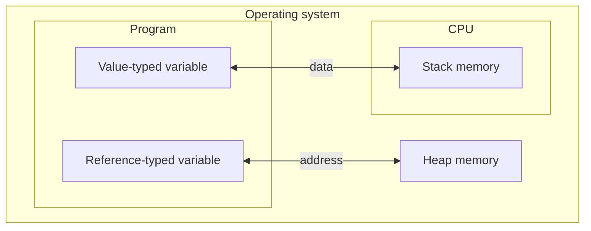
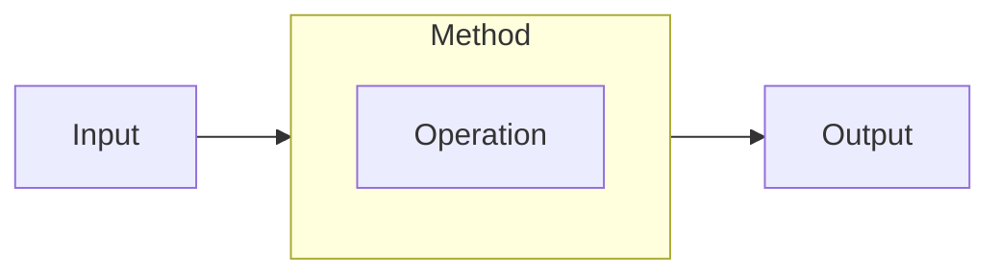

# Foundational C# certification

Source: [Microsoft Learn](https://learn.microsoft.com/en-gb/training/)

Resource: [Microsoft documentation](https://learn.microsoft.com/en-us/dotnet/api/system)

## Table of contents

<!--TOC-->
  - [MODULE 1: BASIC C# CODE](#module-1-basic-c-code)
    - [Introduction](#introduction)
    - [Variables](#variables)
      - [Data types](#data-types)
      - [Implicitly typed variables](#implicitly-typed-variables)
    - [Character escape sequences](#character-escape-sequences)
    - [String interpolation](#string-interpolation)
    - [Type casting](#type-casting)
    - [Practice](#practice)
      - [Challenge 1: Printing on console](#challenge-1-printing-on-console)
      - [Challenge 2: Typed variables](#challenge-2-typed-variables)
      - [Challenge 3: String interpolation](#challenge-3-string-interpolation)
      - [Challenge 4: Operations](#challenge-4-operations)
      - [Project 1 : Average calculator](#project-1-average-calculator)
        - [Console application](#console-application)
      - [Project 2 : GPA calculator](#project-2-gpa-calculator)
  - [MODULE 2: SIMPLE CONSOLE APPLICATIONS](#module-2-simple-console-applications)
    - [Runtime](#runtime)
    - [.NET](#.net)
    - [Create a console application (higher-level)](#create-a-console-application-higher-level)
    - [Build a console application (intermediate level)](#build-a-console-application-intermediate-level)
    - [Run a console application (lower level)](#run-a-console-application-lower-level)
    - [.NET Class Library](#.net-class-library)
    - [Methods](#methods)
      - [Stateful vs stateless](#stateful-vs-stateless)
      - [Object instantiation](#object-instantiation)
      - [Void vs non-void](#void-vs-non-void)
      - [Signature vs overloaded](#signature-vs-overloaded)
    - [Decision logic](#decision-logic)
      - [Code branching](#code-branching)
    - [Arrays](#arrays)
      - [Iteration using foreach](#iteration-using-foreach)
    - [Naming conventions](#naming-conventions)
    - [Commenting](#commenting)
    - [Whitespacing](#whitespacing)
    - [Practice](#practice)
      - [Challenge 5: Method call](#challenge-5-method-call)
      - [Challenge 6: if-else block](#challenge-6-if-else-block)
      - [Challenge 7: foreach  loop](#challenge-7-foreach-loop)
      - [Challenge 8: Code readability](#challenge-8-code-readability)
      - [Project 3: Student grade calculator](#project-3-student-grade-calculator)
  - [MODULE 3: CONSOLE APPLICATIONS LOGIC](#module-3-console-applications-logic)
    - [Variable scope](#variable-scope)
    - [Less is more](#less-is-more)
    - [Booleans](#booleans)
      - [Expression vs statement](#expression-vs-statement)
      - [Evaluation operators](#evaluation-operators)
    - [Inequality operator vs logical negation](#inequality-operator-vs-logical-negation)
    - [Conditional (ternary) operator](#conditional-ternary-operator)
    - [Switch](#switch)
    - [Iteration using for](#iteration-using-for)
    - [Iteration using do-while and while](#iteration-using-do-while-and-while)
    - [Practice](#practice)
      - [Challenge 9: Problematic code](#challenge-9-problematic-code)
      - [Challenge 10: Ternary](#challenge-10-ternary)
      - [Challenge 11: Decision logic](#challenge-11-decision-logic)
      - [Challenge 12: rewrite if-else-if into switch construct](#challenge-12-rewrite-if-else-if-into-switch-construct)
      - [Challenge 13: FizzBuzz](#challenge-13-fizzbuzz)
      - [Challenge 14: Role playing game](#challenge-14-role-playing-game)
      - [Challenge 15: Do-while vs while](#challenge-15-do-while-vs-while)
        - [Integer input](#integer-input)
        - [String input](#string-input)
        - [String array](#string-array)
      - [Project 4: CRUD stray animals app](#project-4-crud-stray-animals-app)
  - [MODULE 4: VARIABLE DATA](#module-4-variable-data)
    - [Data types](#data-types)
      - [Bits and bytes](#bits-and-bytes)
      - [Values (stack) vs references (heap)](#values-stack-vs-references-heap)
      - [Value types](#value-types)
        - [Integral](#integral)
          - [Signed vs unsigned](#signed-vs-unsigned)
        - [Floating](#floating)
      - [Reference types](#reference-types)
      - [Stack vs heap](#stack-vs-heap)
      - [Choosing the right type](#choosing-the-right-type)
    - [Array helper methods](#array-helper-methods)
      - [ref keyword](#ref-keyword)
      - [Removing empty elements from an array](#removing-empty-elements-from-an-array)
      - [Reversing an array](#reversing-an-array)
      - [Splitting an array](#splitting-an-array)
    - [String formatting](#string-formatting)
      - [Specifiers](#specifiers)
      - [Padding](#padding)
    - [String helper methods](#string-helper-methods)
      - [IndexOf](#indexof)
      - [LastIndexOf](#lastindexof)
      - [IndexOfAny](#indexofany)
      - [Remove](#remove)
      - [Replace](#replace)
    - [Data type casting](#data-type-casting)
      - [Implicit casting (safe conversion)](#implicit-casting-safe-conversion)
      - [Explicit casting (unsafe conversion)](#explicit-casting-unsafe-conversion)
    - [Casting methods](#casting-methods)
      - [Helper method on variable](#helper-method-on-variable)
      - [Helper method on data type](#helper-method-on-data-type)
        - [With exception handling](#with-exception-handling)
      - [Convert class methods](#convert-class-methods)
    - [Practice](#practice)
      - [Challenge 16: String arrays and int](#challenge-16-string-arrays-and-int)
      - [Challenge 17: Output specific number types](#challenge-17-output-specific-number-types)
      - [Challenge 18: Reversing words in a sentence](#challenge-18-reversing-words-in-a-sentence)
      - [Challenge 19: Parsing and sorting an array](#challenge-19-parsing-and-sorting-an-array)
      - [Challenge 20: Format string data](#challenge-20-format-string-data)
      - [Project 5: CRUD stray animal app 2](#project-5-crud-stray-animal-app-2)
      - [Project 6: CRUD stray animal app 3](#project-6-crud-stray-animal-app-3)
  - [MODULE 5: METHODS](#module-5-methods)
    - [Parameter vs argument](#parameter-vs-argument)
    - [Scope](#scope)
    - [Parameter behavior by type](#parameter-behavior-by-type)
      - [Value type](#value-type)
      - [Reference type](#reference-type)
        - [String type](#string-type)
    - [Practice](#practice)
      - [Project 7: RVSP app](#project-7-rvsp-app)
      - [Project 8: Employees' emails](#project-8-employees-emails)
- [-](#-)
  - [Basics](#basics)
  - [Booleans](#booleans)
  - [Strings](#strings)
    - [Substring](#substring)
    - [Regex](#regex)
  - [Numbers](#numbers)
  - [Extended methods](#extended-methods)
  - [Tuples](#tuples)
    - [Dictionary](#dictionary)
  - [Nullability](#nullability)
  - [While](#while)
    - [Do While](#do-while)
  - [Class](#class)
    - [Encapsulation](#encapsulation)
  - [Collections](#collections)
    - [For and foreach loop](#for-and-foreach-loop)
    - [Lists](#lists)
  - [Inheritance](#inheritance)
    - [Polymorphism](#polymorphism)
  - [Collections](#collections)
- [Software craft](#software-craft)
  - [Intro](#intro)
  - [Historique](#historique)
    - [V-model](#v-model)
    - [Méthode agile](#methode-agile)
    - [Scrum](#scrum)
    - [XP (Extreme programming)](#xp-extreme-programming)
    - [Agile hangover](#agile-hangover)
    - [Craft](#craft)
  - [Test-driven development (TDD)](#test-driven-development-tdd)
    - [Nommage](#nommage)
    - [Arrange Act Assert](#arrange-act-assert)
    - [Exemple FizzBuzz](#exemple-fizzbuzz)
    - [Red phase](#red-phase)
    - [Green phase](#green-phase)
    - [Final code](#final-code)
- [General knowledge](#general-knowledge)
  - [Extract, Transform, Load (ETL)](#extract-transform-load-etl)
  - [Git](#git)
  - [32-bit (x86), 64-bit (x64)](#32-bit-x86-64-bit-x64)
  - [Data and data accessing](#data-and-data-accessing)
    - [OLEDB](#oledb)
  - [Exception handling](#exception-handling)
    - [Understanding stack tracing](#understanding-stack-tracing)
    - [Three error handling strategies](#three-error-handling-strategies)
  - [Multi-threading](#multi-threading)
    - [Task](#task)
    - [Parallel](#parallel)
  - [Namespaces](#namespaces)
  - [Glossary](#glossary)
  - [Variables](#variables)
    - [Primitive types: numeric](#primitive-types-numeric)
    - [Type casting](#type-casting)
    - [Primitive types: strings](#primitive-types-strings)
    - [Constants](#constants)
<!--/TOC-->

## MODULE 1: BASIC C# CODE

### Introduction

C# is a case-sensitive language.

`console` is different from `Console`.

Interpreting error messages is key:

```c#
console.WriteLine("hello world");
```
```terminal
(1,1): error CS0103: The name 'console' does not exist in the current context
```

C# is a compiled language.

Computers can't understand it directly.

As a result, a compiler translates its syntax at build time into Intermediate Language (IL).

This Intermediate Language is then translated at run time into machine code.

Compilers don't like errors and act as a safeguard.

If the code contains errors, compilation fails.


| Term | Definition | Example |
| --- | --- | --- |
| class | A class is an object, having methods live within it. | `Console` |
| accessor | Methods living within objects can be accessed this way. | `.` |
| method | Each method has one job; they are invoked using parenthesis. | `WriteLine()` |
| literal string | Data is output literally. | `"hello world"` |

### Variables

#### Data types

C# is a strongly-typed language.

Designers believed strict type declaration helped to avoid common bugs.

| Data type | Use case | Example |
| --- | --- | --- |
| string | Presentation or text manipulation. | `string myString = "Hello";` |
| char | Presentation or text manipulation. | `char myChar = 'A';` |
| int | Calculation. | `int myInt = 10;` |
| float | Calculation (6-9 digits). | `float mySmallNumber = 3.14f;` |
| double | Calculation (15-17 digits; default in C#, no literal suffix needed). | `double myMediumNumber = 3.14;` |
| decimal | Calculation (28-29 digits). | `decimal myLargeNumber = 3.14m;` |
| bool | Evaluation. | `bool myBool = true;` |

Variables types are checked at compile time.

Operations on a variable need to be compatible with its type.

#### Implicitly typed variables

The `var` keyword tells the compiler that data type is implied.

```c#
var message = "hello world";
```

You can use `var` when the data type is not known.

However, it's best practice to always type your variables explicitly.

`/!\` C# always attributes a data type to a variable, even if implicit.

### Character escape sequences

| Sequence | Description |
| --- | --- |
| `\n` | new line |
| `\t` | tab |
| `\"` | escape double-quotes |
| `\\` | escape back slashes |
| `@` | output verbatim (as is); keep whitespaces |

### String interpolation

```c#
string one = "hello";
string two = "world";
Console.Write($"{one} {two}");
```

```terminal
hello world
```

```c#
string projectName = "helloWorld";
Console.Write($@"C:\Output\{projectName}\Data");
```

```terminal
C:\Output\helloWorld\Data
```

### Type casting

Make a variable **pretend** to be a different type (within a sort of computed calculation):

```c#
int a = 10;
int b = 4;
double c = a / (double) b;
```

### Practice

#### Challenge 1: Printing on console

```c#
Console.WriteLine("This is the first line.");
Console.Write("This is the second line.");
Console.Write("This is the third line.");
```
```terminal
This is the first line.
This is the second line.This is the third line.
```

#### Challenge 2: Typed variables

```c#
string userName = "Bob";
int messageNumber = 3;
float temperature = 34.4f;

Console.WriteLine($"Hello, {userName}!");
Console.Write($"You have {messageNumber} messages in your inbox. The temperature is {temperature} celsius.");
```

```terminal
Hello, Bob!
You have 3 messages in your inbox. The temperature is 34.4 celsius.
```

#### Challenge 3: String interpolation

```c#
string englishMessage = "View English output:";
string projectName = "ACME";
string englishProjectLocation = $@"c:\Exercise\{projectName}\data.txt";

Console.WriteLine($"{englishMessage}\n\t{englishProjectLocation}\n");

string russianMessage = "\u041f\u043e\u0441\u043c\u043e\u0442\u0440\u0435\u0442\u044c \u0440\u0443\u0441\u0441\u043a\u0438\u0439 \u0432\u044b\u0432\u043e\u0434";
string russianProjectLocation = $@"c:\Exercise\{projectName}\ru-RU\data.txt";

Console.WriteLine($"{russianMessage}\n\t{russianProjectLocation}\n");
```

```terminal
View English output:
	c:\Exercise\ACME\data.txt

Посмотреть русский вывод
	c:\Exercise\ACME\ru-RU\data.txt
```

#### Challenge 4: Operations

```c#
int fahrenheit = 94;
float celsius = (fahrenheit - 32) * (5/9f);
Console.Write($"The temperature is {Math.Round(celsius, 1)} Celsius.");
```

```terminal
The temperature is 34.4 Celsius.
```

#### Project 1 : Average calculator

##### Console application

A `console` application is the simplest form of a C# program.

It takes input and displays output at the console only.

```c#
public class AverageCalculator
{   
    // Properties.
    public float? Average { get; private set; }
    public string? LetterGrade { get; }

    // Constructor.
    public AverageCalculator(int[] grades) 
    { 
        Average = (float) grades.Sum() / grades.Length;

        if (Average >= 97 && Average <= 100)
        {
            LetterGrade = "A+";
        }
        else if (Average >= 93 && Average <= 96)
        {
            LetterGrade = "A";
        }
        else if (Average >= 90 && Average <= 92)
        {
            LetterGrade = "A-";
        }
        else if (Average >= 87 && Average <= 89)
        {
            LetterGrade = "B+";
        }
        else if (Average >= 83 && Average <= 86)
        {
            LetterGrade = "B";
        }
    }

    // Execution.
    public static void Main(string[] args)
    {
        // Grades to convert.
        List<(string, int[])> grades = new List<(string, int[])>()
        {
            ("Sophia", new int[] { 93, 87, 98, 95, 100 }),
            ("Nicolas", new int[] { 80, 83, 82, 88, 85 }),
            ("Zahirah", new int[] { 84, 96, 73, 85, 79 }),
            ("Jeong", new int[] { 90, 92, 98, 100, 97 })
        };

        Console.WriteLine($"Student\t\tAverage\t\tGrade\n");

        foreach (var grade in grades)
        {
            var result = new AverageCalculator(grade.Item2);
            Console.WriteLine($"{grade.Item1}\t\t{result.Average}\t\t{result.LetterGrade}");
        }
    }
}
```

```terminal
Student         Average         Grade

Sophia          94,6            A
Nicolas         83,6            B
Zahirah         83,4            B
Jeong           95,4            A
```

#### Project 2 : GPA calculator

```c#
public class GpaCalculator
{   
    // Properties.
    public float? Gpa { get; private set; }

    // Constructor.
    public GpaCalculator(List<(string, Course)> input)
    {
        var credits = input.Select(e => e.Item2.Credit).ToArray();
        var grades = input.Select(e => e.Item2.Grade).ToArray();

        int[] results = new int[credits.Length];

        for (int i = 0; i < results.Length; i++)
        {
            results[i] = credits[i] * grades[i];
        }

        Gpa = results.Sum() / (float) credits.Sum();
    }

    // Support class.
    public class Course
    {
        public int Credit { get; private set; }
        public int Grade { get; private set; }

        public Course(int credit, int grade)
        {
            Credit = credit;
            Grade = grade;
        }
    }

    // Execution.
    public static void Main(string[] args)
    {
        // Grades to convert.
        List<(string, Course)> finalGrades = new List<(string, Course)>
        {
            ("English 101", new Course(4, 3)),
            ("Algebra 101", new Course(3, 3)),
            ("Biology 101", new Course(3, 4)),
            ("Computer Science 101", new Course(3, 4)),
            ("Pyschology 101", new Course(4, 3))
        };

        float? result = new GpaCalculator(finalGrades).Gpa;
        Console.WriteLine($"{result:F2}");
    }
}
```

```terminal
3,35
```

## MODULE 2: SIMPLE CONSOLE APPLICATIONS

An `IDE` (integrated development environment) is the developer's work toolkit.

It supports the development process or `lifecycle` at the coding level: 


Some IDEs support certain languages by default and others via extensions.

### Runtime

To run C# programs in an IDE, the .NET `runtime` is required.

A runtime is a layer between a program and the operating system of the computer.

It serves pre-built services, like a library, relieving the program from lower-level machine tasks like memory management, input/output (I/O) operations, etc.

The program can then focus its resources on higher-level logic.

A parallel can be drawn with APIs, which also serve pre-built code to programs, in this case routines or modules unrelated to execution.


### .NET

`.NET` is a Microsoft general-purpose framework.


### Create a console application (higher-level)

```terminal
dotnet new console -o ./CsharpProjects/TestProject

// dotnet: driver
// new console: command
// -o ./CsharpProjects/TestProject: arguments (-o stands for output)
```

This command creates two files: `.csproj` and `.cs`.

```xml
// .csproj: project config file.

<Project Sdk="Microsoft.NET.Sdk">

  <PropertyGroup>
    <OutputType>Exe</OutputType>
    <TargetFramework>net8.0</TargetFramework>
    <ImplicitUsings>enable</ImplicitUsings>
    <Nullable>enable</Nullable>
  </PropertyGroup>

</Project>
```

```csharp
// .cs: code file (entry point of the application).

// See https://aka.ms/new-console-template for more information
Console.WriteLine("Hello, World!");
```

### Build a console application (intermediate level)

```terminal
dotnet build
```

Building is the process of compiling the project.

It creates a `bin` folder containing config and execution files the computer can process.

```json
// .deps.json: project build lock file.
// Tracks dependencies and their versions for build consistency.

{
  "runtimeTarget": {
    "name": ".NETCoreApp,Version=v8.0",
    "signature": ""
  },
  "compilationOptions": {},
  "targets": {
    ".NETCoreApp,Version=v8.0": {
      "TestProject/1.0.0": {
        "runtime": {
          "TestProject.dll": {}
        }
      }
    }
  },
  "libraries": {
    "TestProject/1.0.0": {
      "type": "project",
      "serviceable": false,
      "sha512": ""
    }
  }
}
```

``` terminal
// .exe: compiled output of the application in Intermediate Language (IL).
// It can be run by the OS.

"MZ   ÿÿ ¸ @ ð º ´	Í!¸LÍ!This program cannot be run in DOS mode.$ Nv’é
üº
üº
üº
üºüº–ø»üº–ÿ»üº–ù»\üºooºüºAoý»üº
ýºÃüºc–õ» üºc–þ»üºRich
üº PE d† he ð "" & j Ð    @        `Á      ,   € ´ @ ¼ p  0Ó T Õ ( ðÑ @ €  .text œi  j  `.rdata æ• € – n @ @.data P 
...
```

```terminal
// .dll: library for the application in Intermediate Language (IL). 
// Contains reference classes and methods.
// Linked to the .exe, it can't be run by the OS.

MZ   ÿÿ ¸ @ € º ´	Í!¸LÍ!This program cannot be run in DOS mode.$ PE L -W¶ à " 
0   Z' @ @    €   `…      ' O @ ¸ `  ô% T   H .text `   `.rsrc ¸ @  
 @ @.reloc  `   @ B <' H   h Π   2r p(
...
 <Main>$ 
 <Module> 
 System.Console 
 System.Runtime 
 WriteLine 
 ...
 TestProject H e l l o , W o r l d ! ²VóSzÒéNˆæØdÈö—'      °?_Õ
...                   
```

```terminal
// .pdb: Program Database file, essential for debugging the application.

BSJB         PDB v1.0       |   D   #Pdb    À   €   #~  @     #Strings    D     #US H  P   #GUID   ˜  Ä(  #Blob   f,{Ú:ʝI½Ÿü²kdKFÄûÕ  G  	                                          §       „                l  w  Ç  Ù  ) ; x Š  4(                    «('  «'  ƒ'  Å          Ð)ˆ¸B‡‹w…—¬øbQ?ÆӐS ÀO£¡VÌ‘ 8MŸì%«š5jìþµÐŒƒJ–ÚFb„»KØGM~n	\L®Ú˺jt
 C:Userssteven.jimenezsourcerepos2023-11-nov-csharp-fundamentalsCsharpProjectsTestProject
Program.cs
\
 &FUa À§ßl7662¥àN„%e¬’I9šË~(V
–Ê?¤ùobjDebugnet8.0TestProject.GlobalUsings.g.cs\
 &FU€˜€œ€¢€© óñ4éè%ãç&€õ‹ò½¢ÞQ?a œVô‹›a*¼..NETCoreApp,Version=v8.0.AssemblyAttributes.cs\
 &FU€˜€œ€¢€ú ÷¥Ùxœ†6%á9ÿ™á:P80ö¸Zˆö™߃¬v´žTestProject.AssemblyInfo.cs\
```

```json
// .runtimeconfig.json: project runtime config file.
// Specifies the version of the .NET runtime to be used during execution.

{
  "runtimeOptions": {
    "tfm": "net8.0",
    "framework": {
      "name": "Microsoft.NETCore.App",
      "version": "8.0.0"
    },
    "configProperties": {
      "System.Runtime.Serialization.EnableUnsafeBinaryFormatterSerialization": false
    }
  }
}
```

### Run a console application (lower level)

```terminal
dotnet run

// This command builds and runs the application.
```

```
Hello C#!
```

### .NET Class Library

Following the computer science principle of `modularity`, C# offers libraries of functionality.

These are prewritten collections of code.

Collections are organized in classes, which contain invokable methods.

```csharp
System.Console.WriteLine("Hello World");

// System: namespace.
// Console: class.
// WriteLine(): method.
```

In C#, data types are actually classes made available via the .NET library, with built-in methods.

### Methods

#### Stateful vs stateless

`state` is "the collection of all values stored in memory at a specific moment in time".

Stateless or `static` methods are independent of values stored in memory.

Stateful or `instance` methods are dependent on values stored in memory.

Stateful methods use fields (variables) to track state.

```csharp
Random dice = new Random(); // Stateful method.
int roll = dice.Next(1, 7);
Console.WriteLine(roll); // Stateless method.
```

Classes can contain both stateless and stateful methods.

However, invoking stateful methods requires object `instantiation`.

#### Object instantiation

```csharp
Random dice = new Random();

// new: creates a new instance of the Random class.
```

Instantiation is related to memory (statefulness).

The `new` keyword stores the object in memory at a large enough address.

Whenever a stateful method is invoked without object instantiation, compilation fails:

```csharp
int result = Random.Next();
```

```terminal
(1,14): error CS0120: An object reference is required for the non-static field, method, or property 'Random.Next()'
```

#### Void vs non-void

`void` methods end "quietly".

Non-void methods return a value that can be stored in a variable.

```csharp
int roll = dice.Next(1, 7); // Return value stored in roll.
```

```csharp
public static string Reverse(string input) // Parameters.
{
    return new string(input.ToCharArray().Reverse().ToArray());
}

public static void Main(string[] args)
{
    string result = Reverse("Hello World"); // Arguments.
    Console.WriteLine(result);
}
```

```terminal
dlroW olleH
```

#### Signature vs overloaded

The `signature` of a method is the number and data types of the parameters it accepts as input.

A same method can be `overloaded` to hold several signatures (implementations).

This provides more granular control:

```csharp
Random dice = new Random();
Console.WriteLine(dice.Next()); // 662_251_688; a value up to 2_147_483_647.
Console.WriteLine(dice.Next(101)); // 66; a value up to 100.
Console.WriteLine(dice.Next(4, 11)); // 6; a value between 4 and 10.
```

### Decision logic

#### Code branching

```csharp
if (condition)
{
    // Code executed by runtime.
}

if (condition || condition && condition) // Compound condition.
{
    // Code executed by runtime.
}
```

```csharp
if (condition)
{
    if (condition || condition && condition) // Nested compound condition.
    {
        // Code executed by runtime.
    }
}
```

```csharp
if (condition)
{
    // Code.
}
else if (condition) // Improved branching options.
{
    // Code.
}
else if (condition)
{
    // Code.
}
else
{
    // Code.
}
```

### Arrays

A single variable that can hold many related values.

It uses a zero-based index to access elements.

```csharp
string[] array = new string[3]; // New array declaration (address in memory).

array[0] = "hello"; // Value assignment.
array[1] = "world";
array[2] = "hello";

Console.WriteLine($"First: {array[0]}"); // Value retrieval.

array[0] = "haha"; // Value reassignment.

string[] array = { "hello", "world", "hello" }; // Assignment at declaration.

array.Length; // 3
```

#### Iteration using foreach

```csharp
int[] inventory = { 200, 450, 700, 175, 250 };
int sum = 0;
foreach (int entry in inventory)
{
    sum += entry;
}
Console.Write(sum); // 1775
```

```csharp
int[] inventory = { 200, 450, 700, 175, 250 };
int sum = 0;
int bin = 0;
foreach (int entry in inventory)
{
    sum += entry;
    bin++;
    Console.WriteLine($"Bin {bin} = {entry} items (Running total: {sum})");
}
Console.WriteLine($"We have {sum} items in inventory.");
```

```terminal
Bin 1 = 200 items (Running total: 200)
Bin 2 = 450 items (Running total: 650)
Bin 3 = 700 items (Running total: 1350)
Bin 4 = 175 items (Running total: 1525)
Bin 5 = 250 items (Running total: 1775)
We have 1775 items in inventory.
```

### Naming conventions

[C# conventions reference](https://learn.microsoft.com/en-us/dotnet/csharp/fundamentals/coding-style/identifier-names)

```csharp
string myString // camelCase; no need to include the data type in the name (strMyString).
bool processComplete // Descriptive (kind of data the variable will hold).
int orderAmount // Avoid contractions like int ordAmt.
```

### Commenting

Three main uses: adding notes, temporarily removing code for testing purposes, and identifying tasks ("TODO").

```csharp
// Typical comment.

// int myNumber = 0;

// Comment three or more lines.

/*
string firstName = "Bob";
int widgetsPurchased = 7;
Console.WriteLine($"{firstName} purchased {widgetsPurchased} widgets.");
*/
```

Commenting should be reserved for high-level concepts, not operational descriptions of a code snippet.

```csharp
// Example of low-quality comments.
// Difficult to read.

Random random = new Random();
string[] orderIDs = new string[5];
// Loop through each blank orderID
for (int i = 0; i < orderIDs.Length; i++)
{
    // Get a random value that equates to ASCII letters A through E
    int prefixValue = random.Next(65, 70);
    // Convert the random value into a char, then a string
    string prefix = Convert.ToChar(prefixValue).ToString();
    // Create a random number, pad with zeroes
    string suffix = random.Next(1, 1000).ToString("000");
    // Combine the prefix and suffix together, then assign to current OrderID
    orderIDs[i] = prefix + suffix;
}
// Print out each orderID
foreach (var orderID in orderIDs)
{
    Console.WriteLine(orderID);
}
```

```csharp
// Example of high-level comment.

/*
  The following code creates five random OrderIDs
  to test the fraud detection process. OrderIDs 
  consist of a letter from A to E, and a three
  digit number. Ex. A123.
*/

Random random = new Random();
string[] orderIDs = new string[5];

for (int i = 0; i < orderIDs.Length; i++)
{
    int prefixValue = random.Next(65, 70);
    string prefix = Convert.ToChar(prefixValue).ToString();
    string suffix = random.Next(1, 1000).ToString("000");

    orderIDs[i] = prefix + suffix;
}

foreach (var orderID in orderIDs)
{
    Console.WriteLine(orderID);
}
```

Comments are subjective; the most important thing is to write clear and easy to read code.

Never trust comments as they could be outdated.

### Whitespacing

Also subjective; the most important thing is code clarity.

Finding a style and sticking to it.

```csharp
// Whitespace example.

Random dice = new Random(); // Space after a class declaration.

int roll1 = dice.Next(1, 7); // Variable grouping.
int roll2 = dice.Next(1, 7);
int roll3 = dice.Next(1, 7);

int total = roll1 + roll2 + roll3; // Different variable.
Console.WriteLine($"Dice roll: {roll1} + {roll2} + {roll3} = {total}");

if ((roll1 == roll2) || (roll2 == roll3) || (roll1 == roll3)) // if-else block.
{
    if ((roll1 == roll2) && (roll2 == roll3)) 
    {
        Console.WriteLine("You rolled triples!  +6 bonus to total!");
        total += 6; 
    } 
    else 
    {
        Console.WriteLine("You rolled doubles!  +2 bonus to total!");
        total += 2;
    }
}
```

### Practice

#### Challenge 5: Method call

```csharp
public static void Main(string[] args)
{
    int firstValue = 500;
    int secondValue = 600;
    int largerValue = Math.Max(firstValue, secondValue);

    Console.WriteLine(largerValue);
}
```

#### Challenge 6: if-else block

```csharp
public static void Main(string[] args)
{
    Random random = new Random();
    int daysUntilExpiration = random.Next(12);
    int discountPercentage = 0;

    if (daysUntilExpiration == 0)
    {
        Console.WriteLine("Your subscription has expired.");
    }
    else if (daysUntilExpiration == 1)
    {
        Console.WriteLine("Your subscription expires within a day!");
        discountPercentage = 20;
    }
    else if (daysUntilExpiration <= 5)
    {
        Console.WriteLine($"Your subscription expires in {daysUntilExpiration} days.");
        discountPercentage = 10;
    }
    else if (daysUntilExpiration <= 10)
    {
        Console.WriteLine("Your subscription will expire soon. Renew now!");
    }

    if (discountPercentage > 0)
    {
        Console.WriteLine($"Renew now and save {discountPercentage}%!");
    }
}
```

#### Challenge 7: foreach  loop

```csharp
string[] array = { "B123", "C234", "A345", "C15", "B177", "G3003", "C235", "B179" };
foreach (string entry in array)
{
    if (entry.StartsWith("B"))
    {
        Console.WriteLine(entry);
    }
}
```

#### Challenge 8: Code readability

```csharp
public static void GetNumberOfTimesALetterAppearsInText(string input, char lookUpLetter)
{
    /*
    The purpose of this code is
    to count the number of times 
    a particular character appears. 
    */

    int letterCount = 0;
    foreach (char letter in input)
    {
        if (letter == lookUpLetter)
        {
            letterCount++;
        }
    }

    Console.WriteLine(input);
    Console.WriteLine($"'{lookUpLetter}' appears {letterCount} times.");
}

public static void Main()
{
    GetNumberOfTimesALetterAppearsInText("The quick brown fox jumps over the lazy dog.", 'o');
    GetNumberOfTimesALetterAppearsInText("Hello World", 'l');
}
```

```terminal
The quick brown fox jumps over the lazy dog.
'o' appears 4 times.
Hello World
'l' appears 3 times.
```

#### Project 3: Student grade calculator

```csharp
public class Program
{
    private class Student
    {
        public string Name { get; set; }
        public int[] Grades { get; set; }
        public decimal ExamResult { get; set; }
        public decimal OverallResult { get; set; }
        public decimal ExtraCredit { get; set; }
        public string LetterGrade { get; set; }

        public Student(string name, int[] grades)
        {
            Name = name;
            Grades = grades;
            ExamResult = 0;
            OverallResult = 0;
            LetterGrade = string.Empty;
        }
    }

    public static string GetLetterGrade(decimal roundedResult)
    {
        string output = string.Empty;
        List<(string, int, int)> gradesReference = new List<(string, int, int)>()
        {
            ("A",93,96),
            ("A-",90,92),
            ("A+",97,100),
            ("B",83,86),
            ("B-",80,82),
            ("B+",87,89),
            ("C",73,76),
            ("C-",70,72),
            ("C+",77,79),
            ("D",63,66),
            ("D-",60,62),
            ("D+",67,69),
            ("F",0,59)
        };

        foreach (var entry in gradesReference)
        {
            if (roundedResult >= entry.Item2 && roundedResult <= entry.Item3)
            {
                output = entry.Item1;
            }
        }

        return output;
    }

    public static void Main()
    {
        List<Student> students = new List<Student>
        {
            new Student("Sophia", new int[] { 90, 86, 87, 98, 100, 94, 90 }),
            new Student("Andrew", new int[] { 92, 89, 81, 96, 90, 89 }),
            new Student("Emma", new int[] { 90, 85, 87, 98, 68, 89, 89, 89 }),
            new Student("Logan", new int[] { 90, 95, 87, 88, 96, 96 })
        };

        Console.WriteLine("Student\t\tExam Score\tOverall\tGrade\tExtra Credit\n");

        int exams = 5;

        foreach (Student student in students)
        {
            int assignments = 0;
            int credits = 0;

            foreach (int grade in student.Grades)
            {
                assignments++;

                if (assignments <= exams)
                {
                    student.ExamResult += grade;
                }
                else
                {
                    student.ExtraCredit += grade;
                    credits++;
                }
            }
            
            student.ExamResult /= exams;
            decimal delta = (student.ExtraCredit / 10) / exams;
            
            student.OverallResult = student.ExamResult + delta;
            student.ExtraCredit /= credits;

            decimal roundedResult = Math.Round(student.OverallResult, 0);
            student.LetterGrade = GetLetterGrade(roundedResult);

            Console.WriteLine($"{student.Name}:\t\t{student.ExamResult:f1}\t\t{student.OverallResult:f2}\t{student.LetterGrade}\t{student.ExtraCredit} ({delta:f2}pts)");
        }

        Console.WriteLine();
        Console.WriteLine("Press the Enter key to continue");
        Console.ReadLine();
    }
}
```

```terminal
Student         Exam Score      Overall Grade   Extra Credit

Sophia:         92,2            95,88   A       92 (3,68pts)
Andrew:         89,6            91,38   A-      89 (1,78pts)
Emma:           85,6            90,94   A-      89 (5,34pts)
Logan:          91,2            93,12   A       96 (1,92pts)

Press the Enter key to continue
```

## MODULE 3: CONSOLE APPLICATIONS LOGIC

### Variable scope

"Portion of an application where a variable is accessible".

A `code block` holds statements defining an execution path, usually within curly brackets `{}`.

A variable within the code block is only accessible there.

```csharp
bool flag = true;
if (flag)
{
    int value = 10;
    Console.WriteLine($"Inside the code block: {value}");
}
```

```terminal
Inside the code block: 10
```

```csharp
bool flag = true;
if (flag)
{
    int value = 10;
}
Console.WriteLine($"Inside the code block: {value}");
```

```terminal
Program.cs(7,46): error CS0103: The name 'value' does not exist in the current context
```

```csharp
/*
To be able to respond to both true and false execution paths,
the compiler needs variable value to be initialized.
Otherwise, it will not be able to respond when flag is false.
*/

bool flag = true;
int value = 0; 

while (flag)
{
    Console.WriteLine($"Inside the code block: {value}");
    flag = false;
    value = 10;
}

Console.WriteLine($"Outside the code block: {value}");
```

```terminal
Inside the code block: 0
Outside the code block: 10
```

### Less is more

Apply this approach only when it improves readibility; readibility is king.

Curly brackets `{}` can serve as a visual cue.

```csharp
bool flag = true;
if (flag)
{
    Console.WriteLine(flag);
}

if (flag)
    Console.WriteLine(flag);
        
if (flag) Console.WriteLine(flag);
```

```csharp
string name = "steve";

if (name == "bob")
{
    Console.WriteLine("Found Bob");
}
else if (name == "steve")
{
    Console.WriteLine("Found Steve");
}
else
{
    Console.WriteLine("Found Chuck");
}

if (name == "bob")
    Console.WriteLine("Found Bob");
else if (name == "steve")
    Console.WriteLine("Found Steve");
else
    Console.WriteLine("Found Chuck");

if (name == "bob") Console.WriteLine("Found Bob");
else if (name == "steve") Console.WriteLine("Found Steve");
else Console.WriteLine("Found Chuck");
```

### Booleans

True or false decision logic (pathways the code takes in a program).

#### Expression vs statement

"An `expression` is any combination of values (literal or variable), operators and methods that return a single value".

"A `statement` is a complete instruction in C#, composed of one or more expressions".

```csharp
if (input == "hello")

// if: statement.
// (input == "hello"): expression.
```

#### Evaluation operators

| Operator | Description |
| --- | --- |
| `>` | greater than |
| `<` | less than |
| `>=` | greater than or equal to |
| `<=` | less than or equal to |
| `==` | equal to |
| `!=` | not equal to |

Some built-in classes like `String` contain methods evaluating booleans: `Contains()`, `StartsWith()`, `EndsWith()`.

### Inequality operator vs logical negation

```csharp
x != y // Operands are not equal.
!(x == y) // Expression is not true.
```

### Conditional (ternary) operator

"[R]eturn a value that's based on a binary condition".

```csharp
<evaluate this condition> ? <if condition is true, return this value> : <if condition is false, return this value>
```

```csharp
int saleAmount = 1001;
int discount = saleAmount > 1000 ? 100 : 50;
Console.WriteLine($"Discount: {discount}");
```

```csharp
int saleAmount = 1001;
// int discount = saleAmount > 1000 ? 100 : 50;

Console.WriteLine($"Discount: {(saleAmount > 1000 ? 100 : 50)}"); // Inline.
```

### Switch

An alternative to `if-else` branching logic.

A value (switch expression) is evaluated against a list of possible outcomes (case patterns), from top to bottom.

Case patterns are boolean expressions.

A switch is best suited for simple evaluation against simple cases (two lines of code at most).

```csharp
public static string[] GetTitle(int level)
{
    Random random = new Random();
    string[] employees = { "John Smith", "John Doe", "Hello World" };

    int index = random.Next(employees.Length);
    string employee = employees[index];

    string title = string.Empty;

    switch (level)
    {
        case 10:
            title = "Senior Associate";
            break; // Avoid checking other cases.

        case 9: // Multiple labeling.
        case 8:
        case 7:
            title = "Manager";
            break;

        case 6:
            title = "Senior Manager";
            break;

        default: // Choice when no other condition is met.
            title = "Associate";
            break;
    }

    return new string[] { employee, title };
}

public static void Main()
{
    Console.WriteLine($"Employee name\t\tUser title\n");
    for (int i = 0; i < 10; i++)
    {
        Random level = new Random();
        string[] result = GetTitle(level.Next(0, 11));
        Console.WriteLine($"{result[0]}\t\t{result[1]}");
    }
}
```

```terminal
Employee name           User title

John Smith              Manager
John Smith              Associate
Hello World             Senior Manager
John Smith              Associate
John Smith              Associate
John Smith              Associate
Hello World             Associate
Hello World             Senior Manager
John Doe                Associate
Hello World             Associate
```

### Iteration using for

A `foreach` loop iterates once over each item in a sequence of data (array, collection).

A `while` loop iterates over a block of code until a condition is met.

A `for` loop provides more granular control:

```csharp
for (int i = 0; i < 10; i++)
{
    Console.WriteLine(i);
}

// for: keyword.
// int i = 0: initializer.
// i < 10: completion condition.
// i++: action after each iteration.
/*
{
    Console.WriteLine(i); // Code block.
}
*/
```

```csharp
string[] names = { "Alex", "Eddie", "David", "Michael" };
foreach (var name in names)
{
    // Can't reassign value using foreach:
    if (name == "David")
    { 
        name = "Sammy";
    }
}
```

```csharp
string[] names = { "Alex", "Eddie", "David", "Michael" };
for (int i = 0; i < names.Length; i++)
{
    if (names[i] == "David")
    {
        names[i] = "Sammy";
    }
}
```

### Iteration using do-while and while

A `do-while` statement executes at least once, 

whereas a `while` statement executes only if the condition is met:

```csharp
do
{
    // Code here executes at least once.
} while (true);
```

```csharp
Random random = new Random();
int number = 0;

do
{
    number = random.Next(0, 11);
    Console.WriteLine(number);
} while (number != 7);
```

Think of it as an iterative statement with an exit condition.

Without an exit condition, `while` can get into an infinite loop.

```csharp
Random random = new Random();
int number = 0;

while (number != 9)
{
    Console.WriteLine(number);
    number = random.Next(0, 11);
}
Console.WriteLine($"Last number: {number}");
```

```terminal
0
6
8
10
8
6
Last number: 9
```

`continue` allows more granular control within the loop:

```csharp
Random random = new Random();
int current = 0;

do
{
    current = random.Next(1, 11);

    if (current >= 8)
    {
        continue; // Values greater than 7 will never be output.
    }

    Console.WriteLine(current);
} while (current != 7); // Exit condition.
```

### Practice

#### Challenge 9: Problematic code

```csharp
bool found = false;
int total = 0;
int[] numbers = { 4, 8, 15, 16, 23, 42 };

foreach (int number in numbers)
{
    total += number;

    if (number == 42)
    {
        found = true;
    }
}

if (found)
{
    Console.WriteLine("Set contains 42");
}

Console.WriteLine($"Total: {total}");
```

```terminal
Set contains 42
Total: 108
```

#### Challenge 10: Ternary

```csharp
Random random = new Random();
int result = random.Next(0, 2);
Console.WriteLine(result == 0 ? "heads" : "tails");
```

#### Challenge 11: Decision logic

```csharp
public class User
{
    public string Permission { get; set; }
    public int Level { get; set; }

    public User(string permission, int level)
    {
        Permission = permission;
        Level = level;
    }
}

public static void GetAccess(User user)
{
    if (user.Permission == "Admin" && user.Level > 55)
    {
        Console.WriteLine("Welcome, Super Admin user.");
    }
    else if (user.Permission == "Admin" && user.Level <= 55)
    {
        Console.WriteLine("Welcome, Admin user.");
    }
    else if (user.Permission == "Manager" && user.Level >= 20)
    {
        Console.WriteLine("Contact an Admin for access.");
    }
    else if (user.Permission == "Manager" && user.Level < 20)
    {
        Console.WriteLine("You do not have sufficient privileges.");
    }
    else if (user.Permission != "Manager" || user.Permission != "Admin")
    {
        Console.WriteLine("You do not have sufficient privileges.");
    }
}

public static void Main()
{
    Console.WriteLine($"User permission\t\tUser level\t\tMessage\n");
    for (int i = 0; i < 10; i++)
    {
        Random permission = new Random();
        string permissionString = (permission.Next(0, 3) == 0 ? "Admin" : permission.Next(0, 3) == 1 ? "Manager" : "Other");

        Random level = new Random();

        User user = new User(permissionString, level.Next(0, 101));
        Console.Write($"{user.Permission}\t\t\t{user.Level}\t\t\t");
        GetAccess(user);
    }
}
```

```terminal
User permission         User level              Message

Admin                   90                      Welcome, Super Admin user.
Other                   97                      You do not have sufficient privileges.
Admin                   53                      Welcome, Admin user.
Other                   58                      You do not have sufficient privileges.
Admin                   98                      Welcome, Super Admin user.
Manager                 51                      Contact an Admin for access.
Manager                 1                       You do not have sufficient privileges.
Other                   60                      You do not have sufficient privileges.
Other                   10                      You do not have sufficient privileges.
Manager                 51                      Contact an Admin for access.
```

#### Challenge 12: rewrite if-else-if into switch construct

```csharp
public static string[] IfElseIfIntoSwitch()
{
    // SKU = Stock Keeping Unit. 
    // SKU value format: <product #>-<2-letter color code>-<size code>
    string sku = "01-MN-L";

    string[] product = sku.Split('-');

    string type = string.Empty;
    string color = string.Empty;
    string size = string.Empty;

    switch (product[0])
    {
        case "01":
            type = "Sweat shirt";
            break;
        case "02":
            type = "T-Shirt";
            break;
        case "03":
            type = "Sweat pants";
            break;
        default:
            type = "Other";
            break;
    }

    switch (product[1])
    {
        case "BL":
            color = "Black";
            break;
        case "MN":
            color = "Maroon";
            break;
        default:
            color = "White";
            break;
    }

    switch (product[2])
    {
        case "S":
            size = "Small";
            break;
        case "M":
            size = "Medium";
            break;
        case "L":
            size = "Large";
            break;
        default:
            size = "One Size Fits All";
            break;
    }

    return new string[] { sku, type, color, size };
}
```

```terminal
01-MN-L, Sweat shirt, Maroon, Large
```

#### Challenge 13: FizzBuzz

```csharp
string output = string.Empty;

for (int i = 1; i < 101; i++)
{
    bool isDivisibleBy3 = i % 3 == 0;
    bool isDivisibleBy5 = i % 5 == 0;

    if (isDivisibleBy3 && isDivisibleBy5)
    {
        output = $"{i} - FizzBuzz";
    }
    else if (isDivisibleBy5)
    {
        output = $"{i} - Buzz";
    }
    else if (isDivisibleBy3)
    {
        output = $"{i} - Fizz";
    }
    else
    {
        output = $"{i}";
    }

    Console.WriteLine(output);
}
```

```terminal
1
2
3 - Fizz
4
5 - Buzz
6 - Fizz
7
8
9 - Fizz
10 - Buzz
11
12 - Fizz
13
14
15 - FizzBuzz
...
```

#### Challenge 14: Role playing game

```csharp
public class Player
{
    public string Name { get; private set; }
    public int Health { get; set; }

    public Player(string name, int health)
    {
        Name = name;
        Health = health;
    }
}

public static void RolePlayingGame()
{
    Player hero = new Player("Hero", 20);
    Player monster = new Player("Monster", 20);
    int attack;

    do
    {
        attack = new Random().Next(1, 11);
        monster.Health -= attack;
        Console.WriteLine($"{hero.Name} has attacked {monster.Name} by {attack}: {monster.Name}'s health is {(monster.Health <= 0 ? 0 : monster.Health)}");

        if (monster.Health <= 0 || hero.Health <= 0)
        {
            break;
        }

        attack = new Random().Next(1, 11);
        hero.Health -= attack;
        Console.WriteLine($"{monster.Name} has attacked {hero.Name} by {attack}: {hero.Name}'s health is {(hero.Health <= 0 ? 0 : hero.Health)}");

    } while (hero.Health > 0 && monster.Health > 0);
    Console.WriteLine(hero.Health > monster.Health ? $"{hero.Name} wins!" : $"{monster.Name} wins!");
}
```

```terminal
Hero has attacked Monster by 3: Monster's health is 17
Monster has attacked Hero by 8: Hero's health is 12
Hero has attacked Monster by 9: Monster's health is 8
Monster has attacked Hero by 10: Hero's health is 2
Hero has attacked Monster by 10: Monster's health is 0
Hero wins!
```

#### Challenge 15: Do-while vs while

##### Integer input

```csharp
public static void IntegerInput()
{
    string? input;
    bool validEntry = false; // Exit condition.

    Console.WriteLine("Enter an integer value between 5 and 10:");

    do
    {
        input = Console.ReadLine();

        if (int.TryParse(input, out int output))
        {
            if (output >= 5 && output <= 10)
            {
                validEntry = true;
                Console.WriteLine($"Your input value ({output}) has been accepted.");
            }
            else
            {
                Console.WriteLine($"You entered {output}. Please enter a number between 5 and 10:");
            }
        }
        else
        {
            Console.WriteLine("Sorry, you entered an invalid number, please try again:");
        }
    } while (!validEntry);
}
```

```terminal
Enter an integer value between 5 and 10:
two
Sorry, you entered an invalid number, please try again:
2
You entered 2. Please enter a number between 5 and 10:
5
Your input value (5) has been accepted.
```

##### String input

```csharp
public static void StringInput()
{
    string? input;
    bool validEntry = false; // Exit condition.

    string[] roles = ["Administrator", "Manager", "User"];
    string validRole = string.Empty;

    do
    {
        Console.WriteLine("Enter your role name (Administrator, Manager, or User):");
        input = Console.ReadLine();

        foreach (string role in roles)
        {
            if (!string.IsNullOrEmpty(input) && input.Equals(role, StringComparison.OrdinalIgnoreCase))
            {
                validRole = role;
                break;
            }
        }

        if (!string.IsNullOrEmpty(validRole))
        {
            validEntry = true;
            Console.WriteLine($"Your input value({validRole}) has been accepted.");
        }
        else
        {
            Console.WriteLine($"The role name that you entered, \"{input}\" is not valid.");
        }

    } while (!validEntry);
}
```

```terminal
Enter your role name (Administrator, Manager, or User):
hello
The role name that you entered, "hello" is not valid.
Enter your role name (Administrator, Manager, or User):
manager
Your input value(Manager) has been accepted.
```

##### String array

```csharp
public static void StringArray()
{
    string[] myStrings = ["I like pizza. I like roast chicken. I like salad", "I like all three of the menu choices"];
    int periodLocation = -1;

    for (int i = 0; i < myStrings.Length; i++)
    {
        do
        {
            periodLocation = myStrings[i].Contains('.') ? myStrings[i].IndexOf('.') : periodLocation;

            if (periodLocation > 0)
            {
                string tempString = myStrings[i][..periodLocation];
                Console.WriteLine(tempString);
                myStrings[i] = myStrings[i].Remove(0, tempString.Length + 1).Trim();
                periodLocation = -1;
            }
            else
            {
                Console.WriteLine(myStrings[i]);
                break;
            }
        } while (periodLocation < 0);
    }
}
```

```terminal
I like pizza
I like roast chicken
I like salad
I like all three of the menu choices
```

#### Project 4: CRUD stray animals app

This app basically involves implementing CRUD functionality with do-while blocks (create, read, update, delete).

For this project, I developed my own version of the app based on the given instructions.

```csharp
// Fields (variables).
private List<Animal> ourAnimals = new List<Animal>();
private HashSet<string> acceptedSpecies = new HashSet<string>() { "cat", "dog" };
private int idCounter = 1;
private int maxAnimals = 6;
bool isFull;

// Class.
public class Animal
{
    public int Id { get; }
    public string Species { get; set; }
    public string Nickname { get; set; }
    public int? Age { get; set; }
    public string? Characteristics { get; set; }
    public string? Personality { get; set; }

    public Animal(int id, string species, string? age, string? characteristics, string? personality, string nickname)
    {
        Id = id;
        Species = species;
        Age = (!string.IsNullOrEmpty(age)) ? int.Parse(age) : 0;
        Characteristics = characteristics;
        Personality = personality;
        Nickname = nickname;
    }
}
```

```csharp
// 1. Create a static test database, show commands to the user and await input.
public void ContosoPets()
{
    string? input;

    ourAnimals = new List<Animal>
    {
        new Animal(idCounter++, "dog", "4", "Golden retriever, long golden fur, enjoys swimming", "Friendly, devoted, intelligent", "Buddy"),
        new Animal(idCounter++, "dog", "2", "Beagle, tricolor coat, excellent sense of smell", "Curious, loving, determined", "Hunter"),
        new Animal(idCounter++, "cat", "3", "Siamese, cream coat with dark brown points, blue almond - shaped eyes", "Vocal, social, intelligent", "Mocha"),
        new Animal(idCounter++, "cat", "1", "Maine Coon, large size, tufted ears, bushy tail", "Gentle, playful, friendly", "Leo"),
    };

    Console.WriteLine("Welcome to the ContosoPets app.");
    Console.WriteLine($"We currently have {ourAnimals.Count} animals in search of a new home.");

    CheckIfFull();

    if (!isFull)
    {
        Console.WriteLine($"We can shelter {maxAnimals - ourAnimals.Count} more.");
    }
    else
    {
        Console.WriteLine($"Our shelter is full.");
    }

    ShowCommands();

    do
    {
        Console.WriteLine("\nEnter desired command:");
        input = Console.ReadLine();

        switch (input)
        {
            case "all": ListAnimals(); break;
            case "dogs": ListAnimals("dog"); break;
            case "cats": ListAnimals("cat"); break;
            case "add": AddNewAnimal(); break;
            case "edit": EditAnimal(); break;
            case "delete": DeleteAnimal(); break;
            case "search": SearchAnimal(); break;
            case "commands": ShowCommands(); break;
            case "clear": Console.Clear(); break;
            case "quit": Environment.Exit(0); break;
            default: Console.WriteLine("\nSorry, this command is not available. Please try again."); break;
        }

    } while (!string.IsNullOrEmpty(input));
}
```

```csharp
public void CheckIfFull()
{
    isFull = ourAnimals.Count == maxAnimals;
}
```

```csharp
public static void ShowCommands()
{
    Dictionary<string, string> commands = new Dictionary<string, string>
    {
        { "all" , "List all current animals." },
        { "cats" , "List current cats." },
        { "dogs" , "List current dogs." },
        { "add" , "Add a new animal." },
        { "edit" , "Edit an animal." },
        { "delete" , "Delete an animal." },
        { "search" , "Search an animal by keyword." },
        { "commands", "Show commands." },
        { "quit" , "Exit the program." }
    };

    Console.WriteLine("\nCOMMANDS");

    foreach (KeyValuePair<string, string> command in commands)
    {
        Console.WriteLine($"{command.Key,-20}{command.Value}");
    }
}
```

```terminal
Welcome to the ContosoPets app.
We currently have 4 animals in search of a new home.
We can shelter 2 more.

COMMANDS
all                 List all current animals.
cats                List current cats.
dogs                List current dogs.
add                 Add a new animal.
edit                Edit an animal.
delete              Delete an animal.
search              Search an animal by keyword.
commands            Show commands.
quit                Exit the program.

Enter desired command:

```

```csharp
// 2. List (read) current animals, or filter between cats and dogs.
public bool ListAnimals(string? searchSpecies = null, string? searchOtherData = null, int? searchId = null)
{
    PropertyInfo[] properties = typeof(Animal).GetProperties();
    List<Animal> targets = new List<Animal>();

    if (!string.IsNullOrEmpty(searchSpecies)) // Filter by species.
    {
        targets = ourAnimals.Where(e => e.Species == searchSpecies).ToList();
    }
    else if (searchId != null) // Filter by id.
    {
        targets = ourAnimals.Where(e => e.Id == searchId).ToList();
    }
    else if (!string.IsNullOrEmpty(searchOtherData)) // Filter by text in characteristics or personality.
    {
        bool IsValid(string? str)
        {
            return !string.IsNullOrEmpty(str) && str.Contains(searchOtherData, StringComparison.OrdinalIgnoreCase);
        }

        targets = ourAnimals.Where(e => IsValid(e.Characteristics) || IsValid(e.Personality)).ToList();
    }
    else // List all.
    {
        targets = ourAnimals;
    }

    if (searchOtherData is null && targets.Count > 1)
    {
        Console.Write($"\n============================ ALL {(!string.IsNullOrEmpty(searchSpecies) ? (searchSpecies + "s").ToUpper() : "ANIMALS")} ============================\n");
    }
    else if (searchOtherData is not null && targets.Count > 0)
    {
        Console.Write($"\n============================ SEARCH RESULTS: {targets.Count} ============================\n");
    }

    foreach (Animal animal in targets)
    {
        Console.Write("\n");
        foreach (PropertyInfo property in properties)
        {
            Console.WriteLine($"{property.Name,-20}{property.GetValue(animal)}");
        }
    }

    return targets.Count > 0;
}
```

```terminal
Enter desired command:
all

============================ ALL ANIMALS ============================

Id                  1
Species             dog
Nickname            Buddy
Age                 4
Characteristics     Golden retriever, long golden fur, enjoys swimming
Personality         Friendly, devoted, intelligent

Id                  2
Species             dog
Nickname            Hunter
Age                 2
Characteristics     Beagle, tricolor coat, excellent sense of smell
Personality         Curious, loving, determined

Id                  3
Species             cat
Nickname            Mocha
Age                 3
Characteristics     Siamese, cream coat with dark brown points, blue almond - shaped eyes
Personality         Vocal, social, intelligent

Id                  4
Species             cat
Nickname            Leo
Age                 1
Characteristics     Maine Coon, large size, tufted ears, bushy tail
Personality         Gentle, playful, friendly

Enter desired command:

```

```terminal
Enter desired command:
cats

============================ ALL CATS ============================

Id                  3
Species             cat
Nickname            Mocha
Age                 3
Characteristics     Siamese, cream coat with dark brown points, blue almond - shaped eyes
Personality         Vocal, social, intelligent

Id                  4
Species             cat
Nickname            Leo
Age                 1
Characteristics     Maine Coon, large size, tufted ears, bushy tail
Personality         Gentle, playful, friendly

Enter desired command:

```

```csharp
// 3. Create a new entry.
// The app checks if the species entered is valid (cat or dog),
// and if the age is a number less than 20.
public void AddNewAnimal()
{
    CheckIfFull();
    if (isFull)
    {
        Console.WriteLine("\n/!\\ Our shelter is currently full.");
        return;
    }
    
    Console.Write("\n");

    string? species;
    do
    {
        Console.Write($"{string.Join(" or ", acceptedSpecies)[..1].ToUpper()}{string.Join(" or ", acceptedSpecies)[1..]}?\t");
        species = Console.ReadLine();
    } while (string.IsNullOrEmpty(species) || !acceptedSpecies.Contains(species.ToLower()));

    string? nickname;
    do
    {
        Console.Write("Nickname?\t");
        nickname = Console.ReadLine();

    } while (string.IsNullOrEmpty(nickname) || nickname.Length < 2);

    nickname = $"{nickname[..1].ToUpper()}{nickname[1..]}";

    string? age;
    bool isValid = false;
    do
    {
        Console.Write($"Age? (Press 'Enter' to complete later).\t");
        age = Console.ReadLine();

        if (!string.IsNullOrEmpty(age))
        {
            if (int.TryParse(age, out int output) && output < 20)
            {
                isValid = true;
            }
        }
        else
        {
            isValid = true;
        }

    } while (!isValid);

    string? characteristics;

    Console.Write("Characteristics? (Press 'Enter' to complete later).\t");
    characteristics = Console.ReadLine();

    string? personality;

    Console.Write("Personality? (Press 'Enter' to complete later).\t");
    personality = Console.ReadLine();

    try
    {
        Animal newAnimal = new Animal(idCounter++, species.ToLower(), age, characteristics, personality, nickname);
        ourAnimals.Add(newAnimal);
        Console.WriteLine($"\n{nickname} has been successfully added to the database.\n");

        Console.Write($"\n============================ NEW ENTRY START ============================\n");
        ListAnimals(searchId: newAnimal.Id);
            
        Console.WriteLine($"\nWe can shelter {maxAnimals - ourAnimals.Count} more.");
        Console.Write($"\n============================ NEW ENTRY END ============================\n");
    }
    catch
    {
        throw new Exception("An error occurred, please try again.");
    }
}
```

```terminal
Enter desired command:
add

Cat or dog?     fish
Cat or dog?     dog
Nickname?       waldo
Age? (Press 'Enter' to complete later). 50
Age? (Press 'Enter' to complete later). 5
Characteristics? (Press 'Enter' to complete later). brown
Personality? (Press 'Enter' to complete later).

Waldo has been successfully added to the database.


============================ NEW ENTRY START ============================

Id                  5
Species             dog
Nickname            Waldo
Age                 5
Characteristics     Brown
Personality

We can shelter 1 more.

============================ NEW ENTRY END ============================

Enter desired command:

```

```csharp
// 4. Edit (update) an entry.
// The app checks if the id entered is valid.
// The app doesn't allow to modify the id and checks if the species is valid,
// and if age is a number less than 20.
public void EditAnimal()
{
    ListAnimals();

    string? input;
    do
    {
        Console.Write("\nWhich animal would you like to edit (id)?\t");
        input = Console.ReadLine();

        bool isValid = int.TryParse(input, out int output);
        if (!isValid)
        {
            input = null;
            continue;
        }

        Animal? target = ourAnimals.Select(e => e).Where(e => e.Id == output).FirstOrDefault();

        if (target is null)
        {
            input = null;
            continue;
        }
            
        Console.Write($"\n============================ EDIT START ============================\n");

        PropertyInfo? selection = SelectProperty(target);
        UpdateProperty(target, selection);

        Console.Write($"\n============================ EDIT END ============================\n");
        ListAnimals(searchId: target?.Id);

    }
    while (string.IsNullOrEmpty(input));
}
```

```csharp
public PropertyInfo? SelectProperty(Animal? target)
{
    string? input;
    PropertyInfo? selection = null;

    ListAnimals(searchId: target?.Id);

    bool propertyExists = false;
    PropertyInfo[] properties = typeof(Animal).GetProperties();

    do
    {
        Console.Write("\nWhich property?\t");
        input = Console.ReadLine();

        if (!string.IsNullOrEmpty(input))
        {
            if (input.Equals("id", StringComparison.OrdinalIgnoreCase))
            {
                Console.WriteLine("You cannot change this property.");
            }
            else
            {
                foreach (PropertyInfo property in properties)
                {
                    if (property.Name.Equals(input, StringComparison.OrdinalIgnoreCase))
                    {
                        selection = property;
                        propertyExists = true;
                        break;
                    }
                }
            }
        }
    }
    while (string.IsNullOrEmpty(input) || !propertyExists);

    return selection;
}
```

```csharp
public void UpdateProperty(Animal? target, PropertyInfo? selection)
{
    string? input;

    do
    {
        if (selection?.Name == "Species")
        {
            do
            {
                Console.Write($"\nYou can only select between: {string.Join(", ", acceptedSpecies)} \t");
                input = Console.ReadLine();
            } while (string.IsNullOrEmpty(input) || !acceptedSpecies.Contains(input.ToLower()));
        }
        else if (selection?.Name == "Age")
        {
            int age;
            bool isValid;
            do
            {
                Console.Write("Please enter a number.\t");

                input = Console.ReadLine();
                isValid = int.TryParse(input, out age);
            } while (string.IsNullOrEmpty(input) || !isValid || age > 20);
        }
        else
        {
            Console.Write("\nEnter new information:\t");
            input = Console.ReadLine();
        }

        if (!string.IsNullOrEmpty(input))
        {
            if (selection?.PropertyType == typeof(int?))
            {
                selection?.SetValue(target, int.Parse(input));
            }
            else
            {
                selection?.SetValue(target, $"{input[..1].ToUpper()}{input[1..]}");
            }
        }
    }
    while (string.IsNullOrEmpty(input));
}
```

```terminal
Enter desired command:
edit

Which animal would you like to edit (id)?       5

============================ EDIT START ============================

Id                  5
Species             dog
Nickname            Waldo
Age                 5
Characteristics     Brown
Personality

Which property? id
You cannot change this property.

Which property? age
Please enter a number.  50
Please enter a number.  10

============================ EDIT END ============================

Id                  5
Species             dog
Nickname            Waldo
Age                 10
Characteristics     Brown
Personality

Enter desired command:

```

```csharp
// 5. Delete an entry.
public void DeleteAnimal()
{
    ListAnimals();

    string? input;
    do
    {
        Console.Write("\nWhich animal would you like to delete (id)?\t");
        input = Console.ReadLine();

        bool isValid = int.TryParse(input, out int output);
        if (!isValid)
        {
            input = null;
            continue;
        }

        Animal? target = ourAnimals.Select(e => e).Where(e => e.Id == output).FirstOrDefault();

        if (target is null)
        {
            input = null;
            continue;
        }

        ourAnimals.Remove(target);
        Console.Write($"\n============================ DELETE START ============================\n");

        Console.Write($"\nEntry {input} successfully deleted.\n");
        ListAnimals(searchOtherData: "");
        Console.Write($"\n============================ DELETE END ============================\n");
    }
    while (string.IsNullOrEmpty(input));
}
```

```terminal
Enter desired command:
delete

...

Which animal would you like to delete (id)?     1

============================ DELETE START ============================

Entry 1 successfully deleted.

============================ SEARCH RESULTS: 3 ============================

Id                  2
Species             dog
Nickname            Hunter
Age                 2
Characteristics     Beagle, tricolor coat, excellent sense of smell
Personality         Curious, loving, determined

Id                  3
Species             cat
Nickname            Mocha
Age                 3
Characteristics     Siamese, cream coat with dark brown points, blue almond - shaped eyes
Personality         Vocal, social, intelligent

Id                  4
Species             cat
Nickname            Hello
Age                 1
Characteristics     Maine Coon, large size, tufted ears, bushy tail
Personality         Gentle, playful, friendly

============================ DELETE END ============================

Enter desired command:

```

```csharp
// 6. Search by text (characteristic or personality).
public void SearchAnimal()
{
    Console.Write("\nPlease enter a keyword:\t");
    string? input;
    bool IsFound;

    do
    {
        input = Console.ReadLine();
        IsFound = ListAnimals(searchOtherData: input);

        if (!IsFound)
        {
            Console.Write("\nThe keyword entered was not found. Try again:\t");
        }
    }
    while (string.IsNullOrEmpty(input) || !IsFound);
}
```

```terminal
Enter desired command:
search

Please enter a keyword: hello

The keyword entered was not found. Try again:   gentle

============================ SEARCH RESULTS: 1 ============================

Id                  4
Species             cat
Nickname            Hello
Age                 1
Characteristics     Maine Coon, large size, tufted ears, bushy tail
Personality         Gentle, playful, friendly

Enter desired command:

```

## MODULE 4: VARIABLE DATA

### Data types

The objective of using data types is producing error-free code.

#### Bits and bytes

Data is basically values stored in the computer's memory as bits.

A bit is a binary switch between 0 and 1.

In themselves bits are useless; they are meaningful when combined into sequences.

A sequence of 8 bits is a byte.

```terminal
2(0 and 1)^8 = 256 possible combinations
2^16 = 65_536
2^32 = 4_294_967_296
2^64 = 18_446_744_073_709_551_616
```

Possibilities are quite endless when using 64-bit bytes.

#### Values (stack) vs references (heap)

When using a data type, the computer knows exactly how much space to allocate in memory for a given value.

There a two main memory storages: `stack` and `heap`.

Value types can hold smaller values directly (the data itself), and are stored in the stack.

Stack memory is CPU-level and scoped (related to execution).

Examples: `int`, `float`, `double`, `char`, `bool`.

Reference types can hold large values indirectly (an address to the data), and are stored in the heap.

Heap memory is operating-system level and global (unrelated to execution).

Examples: `string`, arrays, objects.



#### Value types

##### Integral

Predefined types (keywords) representing whole numbers, no fractions:

`int` (alias for `System.Int32` class), the most popular.

###### Signed vs unsigned

Signed values can hold negative numbers.

Unsigned cannot, but can hold a larger positive number.

```terminal
Signed integral types:
sbyte  : -128 to 127                                                (8-bit)
short  : -32_768 to 32_767                                          (16-bit)
int    : -2_147_483_648 to 2_147_483_647                            (32-bit)
long   : -9_223_372_036_854_775_808 to 9_223_372_036_854_775_807    (64-bit)
```

```terminal
Unsigned integral types:
byte   : 0 to 255                                                   (8-bit)
ushort : 0 to 65_535                                                (16-bit)
uint   : 0 to 4_294_967_295                                         (32-bit)
ulong  : 0 to 18_446_744_073_709_551_615                            (64-bit)
```

##### Floating

Predefined types (keywords) representing fractions:

`float`, `double`: stored in binary (base 2), which is approximate, but smaller in memory.

`decimal`: stored in decimal (base 10), which is accurate, but larger in memory.

```terminal
Floating point types:
float  : -X,123456789 to X,123456789 (with ~6-9 digits of precision)
double : -X,1234567890123456 to X,1234567890123456 (with ~15-17 digits of precision)
decimal: -X,12345678901234567890123456789 to X,12345678901234567890123456789 (with 28-29 digits of precision)
```

#### Reference types

The `new` keyword assigns value to heap memory.

```csharp
int[] data; // Reference.
data = new int[3]; // Reference pointing to data stored in heap memory (new keyword).
```

`string` is reference type, with `new` being omitted:

```csharp
string str = "Hello World!";
```

```csharp
public class MyClass
{
    public MyClass()
    {
        Console.WriteLine("Hello.");
    }
}

MyClass myClass = new MyClass(); // Hello.
```

#### Stack vs heap

```csharp
int val_A = 2; // Stack 1.
int val_B = val_A; // Stack 2.
val_B = 5;

Console.WriteLine("--Value Types--");
Console.WriteLine($"val_A: {val_A}");
Console.WriteLine($"val_B: {val_B}");
```

```terminal
--Value Types--
val_A: 2 // Stack 1.
val_B: 5 // Stack 2.
```

```csharp
int[] ref_A = new int[1]; // Heap 1.
ref_A[0] = 2;
int[] ref_B = ref_A;
ref_B[0] = 5;

Console.WriteLine("--Reference Types--");
Console.WriteLine($"ref_A[0]: {ref_A[0]}");
Console.WriteLine($"ref_B[0]: {ref_B[0]}");
```

```terminal
--Reference Types--
ref_A[0]: 5 // Heap 1.
ref_B[0]: 5 // Heap 1.
```

#### Choosing the right type

1. Consider data types that fit target data (over fewest bits for performance).
2. Consider the functions using the variables (what types they consume most).
3. When in doubt, stick to basic types:

```csharp
int     // for most whole numbers
decimal // for numbers representing money
bool    // for true or false values
string  // for alphanumeric value
```

4. Don't reinvent data types if one or more data type already exists for a given purpose:

```csharp
byte            // working with encoded data that comes from other computer systems or using different character sets.
double          // working with geometric or scientific purposes. double is used frequently when building games involving motion.
System.DateTime // for a specific date and time value.
System.TimeSpan // for a span of years / months / days / hours / minutes / seconds / milliseconds.
```

### Array helper methods

```csharp
string[] pallets = { "B14", "A11", "B12", "A13" };

Array.Sort(pallets);            // A11 A13 B12 B14
Array.Reverse(pallets);         // B14 B12 A13 A11 
Array.Clear(pallets, 0, 2);     // B12 A13; cleared elements are compiled as null.
```

#### ref keyword

`ref` allows to reuse an address to the heap:

```csharp
string[] pallets = { "B14", "A11", "B12", "A13" };
Array.Resize(ref pallets, 6); // Without ref, a new array would be created and pallets would remain unchanged.
pallets[4] = "C01";
pallets[5] = "C02";
Console.Write(string.Join(" ", pallets); // B14 A11 B12 A13 C01 C02

Array.Resize(ref pallets, 3);
Console.Write(string.Join(" ", pallets); // B14 A11 B12
```

#### Removing empty elements from an array

```csharp
string[] arr = { "B14", "A11", "B12", "A13" };

Array.Resize(ref arr, 8);

arr[4] = "a";
arr[6] = "b";

int index = 0;
string[] newArr = new string[index];

for (int i = 0; i < arr.Length; i++)
{
    if (arr[i] is null)
    {
        continue;
    }

    Array.Resize(ref newArr, index + 1);
    newArr[index] = arr[i];
    index++;
}
```

```terminal
B14 | A11 | B12 | A13
B14 | A11 | B12 | A13 |   |   |   |
B14 | A11 | B12 | A13 | a |   | b |
B14 | A11 | B12 | A13 | a | b
```

#### Reversing an array

```csharp
string input = "abc123";

char[] arr = input.ToCharArray();
Console.WriteLine(arr); // abc123.

Array.Reverse(arr); // Arrays are reference-type; so changes are made to the original array.
Console.WriteLine(arr); // 321cba.

string output = string.Join(", ", arr);
Console.WriteLine(output); // 3, 2, 1, c, b, a.
```

#### Splitting an array

```csharp
string input = "3, 2, 1, c, b, a";
string[] items = output.Split(", ");

foreach (string item in items)
{ 
    Console.WriteLine(item); 
}
```

```terminal
3
2
1
c
b
a
```

### String formatting

```csharp
// Composite formatting (using placeholders within strings).

string first = "Hello";
string second = "World";
string result = string.Format("{0} {1}!", first, second);
Console.WriteLine(result); // Hello World!
```

```csharp
// String interpolation (simplifies composite formatting).
string first = "Hello";
string second = "World";
Console.WriteLine($"{first} {second}!"); // Hello World!
```

#### Specifiers

```csharp
decimal input = 123.31654m;
Console.WriteLine($"{input:c}"); // 123,32 €
Console.WriteLine($"{input:n}"); // 123,32
Console.WriteLine($"{input:n3}"); // 123,317
Console.WriteLine($"{input:p2}"); // 123 31,65 %
```

#### Padding

```csharp
string input = "hello";
Console.WriteLine(input.PadLeft(20, '-'));
Console.WriteLine(input.PadRight(20, '-'));
```

```terminal
---------------hello
hello---------------
```

### String helper methods

#### IndexOf

```csharp
string message = "What is the value <span>between the tags</span>?";

string openingTag = "<span>";
string closingTag = "</span>";

int openingPosition = message.IndexOf(openingTag);
int closingPosition = message.IndexOf(closingTag);

// openingPosition += 6; // Avoid hardcoding magic values.
openingPosition += openingTag.Length;

int length = closingPosition - openingPosition;
Console.WriteLine(message.Substring(openingPosition, length));
```

```terminal
between the tags
```

#### LastIndexOf

```csharp
string message = "(What if) I am (only interested) in the last (set of parentheses)?";

string openingTag = "(";
string closingTag = ")";

int openingPosition = message.LastIndexOf(openingTag);
int closingPosition = message.LastIndexOf(closingTag);
        
openingPosition += openingTag.Length;

int length = closingPosition - openingPosition;
Console.WriteLine(message.Substring(openingPosition, length));
```

```terminal
set of parentheses
```

```csharp
string message = "(What if) I am (only interested) in the last (set of parentheses)?";

string openingTag = "(";
string closingTag = ")";

while (true)
{
    int openingPosition = message.IndexOf(openingTag);
    int closingPosition = message.IndexOf(closingTag);

    if (openingPosition < 0)
    {
        break;
    }

    openingPosition += openingTag.Length;

    int length = closingPosition - openingPosition;

    Console.WriteLine(message.Substring(openingPosition, length));
    message = message.Substring(closingPosition + 1);
}
```

```terminal
What if
only interested
set of parentheses
```

#### IndexOfAny

```csharp
string message = "(What if) I have [different symbols] but every {open symbol} needs a [matching closing symbol]?";

char[] openingTags = ['(', '[', '{'];
char[] closingTags = [')', ']', '}'];

while (true)
{
    int openingPosition = message.IndexOfAny(openingTags);
    if (openingPosition < 0)
    {
        break;
    }

    char openingTag = message[openingPosition]; // Access char within string as if it were an array.
    openingPosition += 1;

    int index = Array.IndexOf(openingTags, openingTag);
    int closingPosition = message.IndexOf(closingTags[index]);

    int length = closingPosition - openingPosition;

    Console.WriteLine(message.Substring(openingPosition, length));
    message = message.Substring(closingPosition + 1);
}
```

```terminal
What if
different symbols
open symbol
matching closing symbol
```

#### Remove

```csharp
string input = "helloworld";
string output1 = input.Remove(5);
string output2 = input.Remove(0, output1.Length);
Console.WriteLine(output1); // hello
Console.WriteLine(output2); // world
```

#### Replace

```csharp
string input = "helloworld";
string output = input.Replace("hello", "world");
Console.WriteLine(output); //worldworld
```

### Data type casting

Since C# is a typed language, it provides a system to convert values to different types (casting).

When casting, the compiler checks if conversions are safe or unsafe.

#### Implicit casting (safe conversion)

1. Executed when no exceptions are thrown:

```csharp
int first = 2;
string second = "4";
string result = first + second; // An int can be converted to a string and concatenated.
Console.WriteLine(result);
```

```terminal
24
```

2. And when no data is lost (widening conversions):

```csharp
int myInt = 1;
decimal myDecimal = myInt; // Converting from a data type that holds less information to one that holds more.
Console.Write(myDecimal);
```

```terminal
1
```

When a conversion is unsafe, the compiler stops:

```csharp
int first = 2;
string second = "4";
int result = first + second;
Console.WriteLine(result);
```

```terminal
C:\Users\someuser\Desktop\csharpprojects\TestProject\Program.cs(3,14): error CS0029: Cannot implicitly convert type 'string' to 'int'
```

#### Explicit casting (unsafe conversion)

When exceptions and data loss can arise, explicit conversions are requested by the compiler:

```csharp
// Narrowing conversion.

decimal myDecimal = 1.23; 
int myInt = (int) myDecimal; // Converting from a data type that holds more information to one that holds less.
Console.Write(myDecimal);
```

```terminal
1
```

### Casting methods

#### Helper method on variable

```csharp
int first = 2;
int second = 4;
string result = first.ToString() + second.ToString(); // Can be obtained implicitly since safe, but a way of saying it's intentional.
Console.WriteLine(result);
```

```terminal
24
```

#### Helper method on data type

```csharp
string first = "2";
string second = "4";
int result = int.Parse(first) + int.Parse(second);
Console.WriteLine(result);
```

```terminal
6
```

##### With exception handling

```csharp
string first = "hello";
string second = "4";
int result = int.Parse(first) + int.Parse(second); // Format exception thrown.
Console.WriteLine(result);
```

```csharp
string first = "hello";
string second = "4";
int.TryParse(first, out int intFirst);
int.TryParse(second, out int intSecond);
int result = intFirst + intSecond;
Console.WriteLine(result);
```

```terminal
4
```

#### Convert class methods

```csharp
string first = "2";
string second = "4";
int result = Convert.ToInt32(first) + Convert.ToInt32(second); // Best for converting fractions into whole numbers.
Console.WriteLine(result);
```

```terminal
6
```

### Practice

#### Challenge 16: String arrays and int

```csharp
public static void StringAndInt(string[] values)
{
    StringBuilder sb = new StringBuilder();
    decimal sum = 0;

    foreach (string value in values)
    {
        if (decimal.TryParse(value, CultureInfo.InvariantCulture, out decimal result))
        {
            sum += result;
        }
        else
        {
            sb.Append(value);
        }
    }

    Console.WriteLine($"Message: {sb}");
    Console.WriteLine($"Total: {sum}");
}
```

```terminal
Message: ABCDEF
Total: 68,3
```

#### Challenge 17: Output specific number types

```csharp
public static void NumberTypes()
{
    int value1 = 11;
    decimal value2 = 6.2m;
    float value3 = 4.3f;

    int result1 = Convert.ToInt32(value1 / value2);
    Console.WriteLine($"Divide value1 by value2, display the result as an int: {result1}");

    decimal result2 = value2 / (decimal) value3;
    Console.WriteLine($"Divide value2 by value3, display the result as a decimal: {result2}");

    float result3 = value3 / value1;
    Console.WriteLine($"Divide value3 by value1, display the result as a float: {result3}");
}
```

```terminal
Divide value1 by value2, display the result as an int: 2
Divide value2 by value3, display the result as a decimal: 1,4418604651162790697674418605
Divide value3 by value1, display the result as a float: 0,3909091
```

#### Challenge 18: Reversing words in a sentence

```csharp
public static void Pangram(string input)
{
    StringBuilder sb = new StringBuilder();

    string[] items = input.Split(" ");
    foreach (string item in items)
    {
        char[] arr = item.ToCharArray();
        Array.Reverse(arr);
        sb.Append(arr);
        sb.Append(' ');
    }
        
    Console.WriteLine(string.Join(" ", sb).Trim());
}
```

```terminal
ehT kciuq nworb xof spmuj revo eht yzal god
```

#### Challenge 19: Parsing and sorting an array

```csharp
public static void OrderIds(string input)
{
    string[] items = input.Split(",");
    Array.Sort(items);

    foreach (string item in items)
    {
        if (item.Length == 4)
        {
            Console.WriteLine(item);
        }
        else
        {
            Console.WriteLine($"{item}\t- Error");
        }
    }
}
```

```terminal
A345
B123
B177
B179
C15     - Error
C234
C235
G3003   - Error
```

#### Challenge 20: Format string data

```csharp
public static void FormatStringData()
{
    const string input = "<div><h2>Widgets &trade;</h2><span>5000</span></div>";

    string quantity = "";
    string output = "";

    string[] openingTags = ["<div>", "<span>"];

    foreach (string tag in openingTags)
    {
        int openingPosition = input.IndexOf(tag);
        openingPosition += tag.Length;

        string closingTag = tag.Replace("<", "</");
        int closingPosition = input.IndexOf(closingTag);

        int length = closingPosition - openingPosition;

        if (Array.IndexOf(openingTags, tag) == 0)
        {
            output = input.Substring(openingPosition, length);
            output = output.Replace("&trade;", "&reg;");
        }
        else
        {
            quantity = input.Substring(openingPosition, length);
        }
    }

    Console.WriteLine($"Quantity: {quantity}");
    Console.WriteLine($"Output: {output}");
}
```

```terminal
Quantity: 5000
Output: <h2>Widgets &reg;</h2><span>5000</span>
```

#### Project 5: CRUD stray animal app 2

```csharp
public static void Contoso2()
{
    CultureInfo.CurrentCulture = new CultureInfo("fr-FR");
    Console.OutputEncoding = Encoding.UTF8;

    string welcomeMessage = $"Welcome to the Contoso PetFriends app. Your main menu options are:" +
        $"\n 1. List all of our current pet information" +
        $"\n 2. Display all dogs with a specified characteristic";

    // #1 the ourAnimals array will store the following: 
    string animalSpecies = "";
    string animalID = "";
    string animalAge = "";
    string animalPhysicalDescription = "";
    string animalPersonalityDescription = "";
    string animalNickname = "";
    string suggestedDonation = "";

    // #2 variables that support data entry
    int maxPets = 8;
    string? readResult;
    string menuSelection = "";
    decimal decimalDonation = 0.00m;

    // #3 array used to store runtime data, there is no persisted data
    string[,] ourAnimals = new string[maxPets, 7];

    // #4 create sample data ourAnimals array entries
    for (int i = 0; i < maxPets; i++)
    {
        switch (i)
        {
            case 0:
                animalSpecies = "dog";
                animalID = "d1";
                animalAge = "2";
                animalPhysicalDescription = "medium sized cream colored female golden retriever weighing about 45 pounds. housebroken.";
                animalPersonalityDescription = "loves to have her belly rubbed and likes to chase her tail. gives lots of kisses.";
                animalNickname = "lola";
                suggestedDonation = "85,00";
                break;

            case 1:
                animalSpecies = "dog";
                animalID = "d2";
                animalAge = "9";
                animalPhysicalDescription = "large reddish-brown male golden retriever weighing about 85 pounds. housebroken.";
                animalPersonalityDescription = "loves to have his ears rubbed when he greets you at the door, or at any time! loves to lean-in and give doggy hugs.";
                animalNickname = "gus";
                suggestedDonation = "49,00";
                break;

            case 2:
                animalSpecies = "cat";
                animalID = "c3";
                animalAge = "1";
                animalPhysicalDescription = "small white female weighing about 8 pounds. litter box trained.";
                animalPersonalityDescription = "friendly";
                animalNickname = "snow";
                suggestedDonation = "40,00";
                break;

            case 3:
                animalSpecies = "cat";
                animalID = "c4";
                animalAge = "3";
                animalPhysicalDescription = "Medium sized, long hair, yellow, female, about 10 pounds. Uses litter box.";
                animalPersonalityDescription = "A people loving cat that likes to sit on your lap.";
                animalNickname = "Lion";
                suggestedDonation = "";
                break;

            default:
                animalSpecies = "";
                animalID = "";
                animalAge = "";
                animalPhysicalDescription = "";
                animalPersonalityDescription = "";
                animalNickname = "";
                suggestedDonation = "";
                break;

        }

        ourAnimals[i, 0] = "ID #: " + animalID;
        ourAnimals[i, 1] = "Species: " + animalSpecies;
        ourAnimals[i, 2] = "Age: " + animalAge;
        ourAnimals[i, 3] = "Nickname: " + animalNickname;
        ourAnimals[i, 4] = "Physical description: " + animalPhysicalDescription;
        ourAnimals[i, 5] = "Personality: " + animalPersonalityDescription;

        if (!decimal.TryParse(suggestedDonation, out decimalDonation))
        {
            decimalDonation = 45.00m;
        }
        ourAnimals[i, 6] = $"Suggested donation: {decimalDonation:c2}";
    }

    // #5 display the top-level menu options
    do
    {
        Console.Clear();

        Console.WriteLine($"{welcomeMessage}");
        Console.WriteLine();
        Console.WriteLine("Enter your selection number (or type Exit to exit the program)");

        readResult = Console.ReadLine();
        if (readResult != null)
        {
            menuSelection = readResult.ToLower();
        }

        // use switch-case to process the selected menu option
        switch (menuSelection)
        {
            case "1":
                // list all pet info
                for (int i = 0; i < maxPets; i++)
                {
                    if (ourAnimals[i, 0] != "ID #: ")
                    {
                        Console.WriteLine();
                        for (int j = 0; j < 7; j++)
                        {
                            Console.WriteLine(ourAnimals[i, j]);
                        }
                    }
                }
                Console.WriteLine("\n\rPress the Enter key to continue");
                readResult = Console.ReadLine();

                break;

            case "2":
                // Display all dogs with a specified characteristic
                string userInput = string.Empty;
                int matches = 0;

                while (string.IsNullOrEmpty(userInput))
                {
                    Console.Clear();

                    Console.WriteLine($"{welcomeMessage}");
                    Console.WriteLine();
                    Console.WriteLine("Enter your selection number (or type Exit to exit the program)");
                    Console.WriteLine("2");
                    Console.WriteLine();
                    Console.WriteLine("Enter one desired dog characteristic to search for:");
                    readResult = Console.ReadLine();

                    if (!string.IsNullOrEmpty(readResult))
                    {
                        userInput = readResult.ToLower().Trim();
                    }
                }

                for (int i = 0; i < maxPets; i++)
                {
                    if (ourAnimals[i, 1].Contains("dog"))
                    {
                        Regex regex = new Regex(userInput);
                        string characteristics = $"{ourAnimals[i, 4]}{ourAnimals[i, 5]}";

                        if (regex.Match(characteristics).Success)
                        {
                            Console.WriteLine();
                            for (int j = 0; j < 7; j++)
                            {
                                Console.WriteLine(ourAnimals[i, j]);
                            }

                            matches++;
                        }
                    }
                }

                if (matches < 1)
                {
                    Console.WriteLine();
                    Console.WriteLine("No matches found.");
                }

                Console.WriteLine();
                Console.WriteLine("Press the Enter key to continue.");
                readResult = Console.ReadLine();
                break;

            default:
                break;
        }

    } while (menuSelection != "exit");
}
```

#### Project 6: CRUD stray animal app 3

```csharp 
public static void Contoso3()
{
    CultureInfo.CurrentCulture = new CultureInfo("fr-FR");
    Console.OutputEncoding = Encoding.UTF8;

    string welcomeMessage = $"Welcome to the Contoso PetFriends app. Your main menu options are:" +
        $"\n 1. List all of our current pet information." +
        $"\n 2. Display all dogs with a specified characteristic.";

    // Data entry variables -------------------------------------------
    int id = 0;
    string? readResult;
    string menuSelection = "";

    // Static data ----------------------------------------------------
    List<Animal> ourAnimals = new List<Animal>() {
    new Animal(
        ++id,
        "dog",
        "2",
        "medium sized cream colored female golden retriever weighing about 45 pounds. housebroken.",
        "loves to have her belly rubbed and likes to chase her tail. gives lots of kisses.",
        "lola",
        "85,00"),

    new Animal(
        ++id,
        "dog",
        "9",
        "large reddish-brown male golden retriever weighing about 85 pounds. housebroken.",
        "loves to have his ears rubbed when he greets you at the door, or at any time! loves to lean-in and give doggy hugs.",
        "gus",
        "49,00"),

    new Animal(
        ++id,
        "cat",
        "1",
        "small white female weighing about 8 pounds. litter box trained.",
        "friendly",
        "snow",
        "40,00"),

    new Animal(
        ++id,
        "cat",
        "3",
        "Medium sized, long hair, yellow, female, about 10 pounds. Uses litter box.",
        "A people loving cat that likes to sit on your lap.",
        "Lion")
    };

    // Menu options ---------------------------------------------------
    do
    {
        Console.Clear();

        Console.WriteLine($"{welcomeMessage}");
        Console.WriteLine();
        Console.WriteLine("Enter your selection number (or type Exit to exit the program)");

        readResult = Console.ReadLine();
        if (readResult != null)
        {
            menuSelection = readResult.ToLower();
        }

        // Switch case ------------------------------------------------
        switch (menuSelection)
        {
            case "1":
                foreach (Animal animal in ourAnimals)
                {
                    Console.WriteLine();

                    PropertyInfo[] properties = animal.GetType().GetProperties();
                    foreach (PropertyInfo property in properties)
                    {
                        Console.WriteLine($"{property.Name}: {property.GetValue(animal)}");
                    }
                }

                Console.WriteLine("\n\rPress the Enter key to continue");
                readResult = Console.ReadLine();

                break;

            case "2":
                // 2. Search functionality ----------------------------
                string[] loadingIcons = [".", "..", "..."];
                List<string> lookUpWords = new List<string>();
                List<string> lookAgainstWords = new List<string>();
                List<string> notFoundWords = new List<string>();
                Dictionary<Animal, List<string>> results = new Dictionary<Animal, List<string>>();

                readResult = string.Empty;

                // List input data ------------------------------------
                while (string.IsNullOrEmpty(readResult))
                {
                    Console.Clear();

                    Console.WriteLine($"{welcomeMessage}");
                    Console.WriteLine();
                    Console.WriteLine("Enter your selection number (or type Exit to exit the program)");
                    Console.WriteLine("2");
                    Console.WriteLine();
                    Console.WriteLine("Enter desired dog characteristics to search for:");
                    readResult = Console.ReadLine();

                    if (!string.IsNullOrEmpty(readResult))
                    {
                        Regex regex = new Regex(@"\w+");
                        foreach (Match match in regex.Matches(readResult))
                        {
                            lookUpWords.Add(match.Value.ToLower());
                        }
                    }
                }

                Console.WriteLine();

                // Loading icons --------------------------------------
                foreach (string icon in loadingIcons)
                {
                    Console.Write($"\rSearching {icon}");
                    Thread.Sleep(200);
                }

                Console.WriteLine();

                // Compare input against base -------------------------
                foreach (Animal animal in ourAnimals)
                {
                    if (animal.Species != "dog")
                    {
                        continue;
                    }

                    foreach (string word in lookUpWords)
                    {
                        string lookAgainstString = $"{animal.Characteristics} {animal.Personality}";
                        if (!string.IsNullOrEmpty(lookAgainstString))
                        {
                            Regex regex = new Regex(@"\w+");
                            foreach (Match match in regex.Matches(lookAgainstString))
                            {
                                lookAgainstWords.Add(match.Value.ToLower());
                            }
                        }

                        if (lookAgainstWords.Contains(word))
                        {
                            if (results.ContainsKey(animal))
                            {
                                results[animal].Add(word);
                            }
                            else
                            {
                                results.Add(animal, new List<string> { word });
                            }
                        }
                        lookAgainstWords.Clear();
                    }
                }

                // Print found data -----------------------------------
                foreach (var entry in results)
                {
                    Console.WriteLine();

                    foreach (var word in entry.Value)
                    {
                        Console.WriteLine($"=> Match found for pet {entry.Key.Nickname}, word: '{word}'");
                    }

                    Console.WriteLine();

                    PropertyInfo[] properties = entry.Key.GetType().GetProperties();
                    foreach (PropertyInfo property in properties)
                    {
                        Console.WriteLine($"{property.Name}: {property.GetValue(entry.Key)}");
                    }
                }

                // Print not found data -------------------------------
                foreach (string lookUpWord in lookUpWords)
                {
                    if (results.Count < 1)
                    {
                        notFoundWords.Add(lookUpWord);
                    }
                    else
                    {
                        foreach (var entry in results)
                        {
                            if (!entry.Value.Contains(lookUpWord))
                            {
                                notFoundWords.Add(lookUpWord);
                            }
                        }
                    }
                }

                if (notFoundWords.Count > 0)
                {
                    Console.WriteLine();

                    foreach (string word in notFoundWords)
                    {
                        Console.WriteLine($"=> No match found for word: '{word}'");
                    }
                }

                Console.WriteLine();
                Console.WriteLine("Press the Enter key to continue.");
                readResult = Console.ReadLine();
                break;

            default:
                break;
        }

    } while (menuSelection != "exit");
}
```

## MODULE 5: METHODS

A method is like a black box performing operations on input data:



### Parameter vs argument

```csharp
// Parameter: variable in the method signature.
public static void PrintMessage(string message) => Console.WriteLine(message);

// Argument: Value passed to the method.
PrintMessage("Hello world.");
```

### Scope

It is best practice to keep variables within the smallest scope necessary.

If a global variable is used, passing it as an argument keeps the method independent and modular.

```csharp
double pi = 3.14159; // Global (top-level) variable, shared by more than one method.

void PrintCircleArea(int radius, double pi)
{
    double area = pi * (radius * radius); // Local variable.
    Console.WriteLine($"Area = {area}");
}

PrintCircleArea(12, pi);
```

### Parameter behavior by type

#### Value type

```csharp
// The argument variable is actually a copy.
// Changes made to the copy (inner) do not affect the original variable (outer).
void ModifyValue(int x)
{
    x = 10;
}

int x = 0;
Console.WriteLine(x); // 0.
        
ModifyValue(x);
Console.WriteLine(x); // Still 0.
```

#### Reference type

```csharp
// The argument variable is not a copy, but a reference to the value itself.
// Changes made to the copy (inner) do affect the original variable (outer).
void ModifyReference(int[] arr)
{
    arr[0] = 10;
    arr[1] = 20;
    arr[2] = 30;
}

int[] arr = [1, 2, 3];
Console.WriteLine(string.Join(", ", arr)); // 1, 2, 3.

ModifyReference(arr);
Console.WriteLine(string.Join(", ", arr)); // 10, 20, 30.
```

##### String type

```csharp
// string is a special type: it is an immutable reference type behaving like a value type.

void ModifyString(string str)
{
    str = "World Hello";
}

string original = "Hello World";
Console.WriteLine(original); // Hello World.
        
ModifyString(original);
Console.WriteLine(original); // Still Hello World.
```

### Practice

#### Project 7: RVSP app

```csharp
public static void RSVP()
{
    Invitee[] invitees =
    [
        new Invitee("Rebecca"),
        new Invitee("Nadia", partySize: 2, allergie: "Nuts"),
        new Invitee("Linh", partySize: 2, inviteOnly: false),
        new Invitee("Tony", allergie: "Jackfruit"),
        new Invitee("Noor", 4, inviteOnly: false),
        new Invitee("Jonte", 2, false, "Stone fruit")
    ];

    string[] guestList = { "Rebecca", "Nadia", "Noor", "Jonte" };
    string[] rsvps = new string[10];
    int count = 0;

    foreach (Invitee invitee in invitees)
    {
        bool isOnList = RSVP(invitee.Name, invitee.PartySize, invitee.Allergies, invitee.InviteOnly, guestList, rsvps, count);
        if (isOnList)
        {
            count++;
        }
    }

    ShowRSVPs(rsvps, count);
}

public static bool RSVP(string name, int partySize, string allergies, bool inviteOnly, string[] guestList, string[] rsvps, int count)
{
    if (inviteOnly)
    {
        bool found = false;
        foreach (string guest in guestList)
        {
            if (guest.Equals(name))
            {
                found = true;
                break;
            }
        }
        if (!found)
        {
            Console.WriteLine($"Sorry, {name} is not on the guest list");
            return false;
        }
    }

    rsvps[count] = $"Name: {name}, \tParty Size: {partySize}, \tAllergies: {allergies}";
    return true;
}

public static void ShowRSVPs(string[] rsvps, int count)
{
    Console.WriteLine("\nTotal RSVPs:");
    for (int i = 0; i < count; i++)
    {
        Console.WriteLine(rsvps[i]);
    }
}
```

```terminal
Sorry, Tony is not on the guest list

Total RSVPs:
Name: Rebecca,  Party Size: 1,  Allergies: none
Name: Nadia,    Party Size: 2,  Allergies: Nuts
Name: Linh,     Party Size: 2,  Allergies: none
Name: Noor,     Party Size: 4,  Allergies: none
Name: Jonte,    Party Size: 2,  Allergies: Stone fruit
```

#### Project 8: Employees' emails

```csharp
public static void EmployeeEmails()
{
    string[,] employees =
    {
        {"int", "Robert", "Bavin"}, {"int", "Simon", "Bright"},
        {"int", "Kim", "Sinclair"}, {"int", "Aashrita", "Kamath"},
        {"int", "Sarah", "Delucchi"}, {"int", "Sinan", "Ali"},
        {"ext", "Vinnie", "Ashton"}, {"ext", "Cody", "Dysart"},
        {"ext", "Shay", "Lawrence"}, {"ext", "Daren", "Valdes"}
    };

    string externalDomain = "hayworth.com";

    for (int i = 0; i < employees.GetLength(0); i++)
    {
        DisplayEmail(
            name: employees[i, 1],
            surName: employees[i, 2],
            domain: employees[i, 0] == "ext" ? externalDomain : "contoso.com");
    }
}

public static void DisplayEmail(string name, string surName, string domain)
{
    string email = $"{name.Substring(0, 2).ToLower()}";
    email += $"{surName.ToLower()}";
    email += $"@{domain}";

    Console.WriteLine($"{email}");
}
```

```terminal
robavin@contoso.com
sibright@contoso.com
kisinclair@contoso.com
aakamath@contoso.com
sadelucchi@contoso.com
siali@contoso.com
viashton@hayworth.com
codysart@hayworth.com
shlawrence@hayworth.com
davaldes@hayworth.com
```

# -

## Basics

C# is a statically-typed language:

```c#
int explicitVar = 10; // Explicitly typed
var implicitVar = 10; // Implicitly typed
```

And an object-oriented language where functions are defined in classes.

Classes need to be instantiated using `new`:

```C#
class Calculator
{
    // ...
}

var calculator = new Calculator();
```

Classes group methods, whose parameters and return values need to be explicitly typed.

`public` allows a method to be called by code in other files.

```c#
class Calculator
{
    public int Add(int x, int y)
    {
        return x + y;
    }
}
```

Comments can be single line `//` or multiline `/* */`.

## Booleans

Type `bool`.

Operators `!` (NOT), `&&` (AND), and `||` (OR).

## Strings

### Substring

```c#
public static string Message(string logLine)
    {
        int first = logLine.IndexOf(":") + ":".Length;
        int last = logLine.Length;
        return logLine.Substring(first, last - first).Trim();
    }
```

```terminal
LogLine.Message("[ERROR]: Invalid operation")
// => "Invalid operation"
```

### Regex

```c#
public static string LogLevel(string logLine)
    {
        Regex rx = new Regex("\\[(.*)\\]");
        MatchCollection matches = rx.Matches(logLine);
        return matches[0].Groups[1].Value.ToLower();
    }
```

```terminal
// "[ERROR]: Disk full"
error
```

## Numbers

Digit separator:

```c#
int largeInt = 1_000_000;
// => 1000000

double largeDouble = 9_876_543.21;
// => 9876543.21
```

## Extended methods

```c#
// TODO: define the 'SubstringAfter()' extension method on the `string` type
    public static string SubstringAfter(this string str, string input) {
        return str.Split(input)[1];
    }
    // TODO: define the 'SubstringBetween()' extension method on the `string` type
    
    public static string SubstringBetween(this string str, string input1, string input2) {
        return str.Split(input1)[1].Split(input2)[0];
    }
    
    // TODO: define the 'Message()' extension method on the `string` type
    public static string Message(this string str) {
        return str.SubstringAfter("]:").Trim();
    }
    // TODO: define the 'LogLevel()' extension method on the `string` type
    public static string LogLevel(this string str) {
        return str.SubstringBetween("[", "]");
    }
```

```c#
public static class Bob
{
    // Check if string is uppercase
    private static bool IsUpperCase(this string statement) =>
        statement.Any(char.IsLetter) &&
        statement.All(e => !char.IsLetter(e) || char.IsUpper(e));

    // Check if string ends with ?
    private static bool IsQuestion(this string statement) => statement.Trim().EndsWith("?");
    
    public static string Response(string statement)
    {
        if (statement.IsQuestion() && statement.IsUpperCase()) {
            return "Calm down, I know what I'm doing!";
        }
    
        if (statement.IsQuestion()) {
            return "Sure.";
        }
    
        if (statement.IsUpperCase()) {
            return "Whoa, chill out!";
        }
    
        if (string.IsNullOrWhiteSpace(statement)) {
            return "Fine. Be that way!";
        }
            
        return "Whatever.";
    }
}
```

## Tuples

```c#
string boast = "All you need to know";
bool success = !string.IsNullOrWhiteSpace(boast);
(bool, int, string) triple = (success, 42, boast);
```

```c#
// Change tuple field names

// Name items in declaration
(bool success, string message) results = (true, "well done!");
bool mySuccess = results.success;
string myMessage = results.message;

// Name items in creating expression
var results2 = (success: true, message: "well done!");
bool mySuccess2 = results2.success;
string myMessage2 = results2.message;
```

```c#
public static class PhoneNumber
{
    private static string IsSplit(this string phoneNumber, int index) {
        return phoneNumber.Split("-")[index];
    }
    
    public static (bool IsNewYork, bool IsFake, string LocalNumber) Analyze(string phoneNumber)
    {
        return ((phoneNumber.IsSplit(0) == "212"), phoneNumber.IsSplit(1) == "555", phoneNumber.IsSplit(2));
    }

    public static bool IsFake((bool IsNewYork, bool IsFake, string LocalNumber) phoneNumberInfo) => phoneNumberInfo.IsFake;
}
```

### Dictionary

```c#
public static class ScrabbleScore
{
    public static int Score(string input)
        {
            List<(string, int)> tuples = new()
            {
                ("aeioulnrst", 1),
                ("dg", 2),
                ("bcmp", 3),
                ("fhvwy", 4),
                ("k", 5),
                ("jx", 8),
                ("qz", 10)
            };

            Dictionary<char, int> dictionary = new();

            foreach (var tuple in tuples)
            {
                foreach (char c in tuple.Item1)
                {
                    dictionary[c] = tuple.Item2;
                }
            }

            int count = 0;

            char[] charArray = input.ToLower().ToArray();

            foreach (char c in charArray)
            {
                count += dictionary[c];
            }
        
        return count;
    }
}
```

## Nullability

```c#
public static string Print(int? id, string name, string? department)
    {
        
        if (!id.HasValue && string.IsNullOrEmpty(department)) {
            return $"{name} - OWNER";
        }
        
        if (!id.HasValue) {
            return $"{name} - {department.ToUpper()}"; 
        }

        if (string.IsNullOrEmpty(department)) {
            return $"[{id}] - {name} - OWNER";
        }
        
        return $"[{id}] - {name} - {department.ToUpper()}";
    }
```

## While

```c#
int x = 23;

while (x > 10)
{
    // Execute logic if x > 10
    x = x - 2;
}
```

### Do While
```c#
int x = 23;

// Execute at least once, then loop
do
{
    // Execute logic if x > 10
    x = x - 2;
} while (x > 10)
```

## Class

Primary C# object-oriented construct.

Combination of fields (data) and methods (behaviors): members.

Access to members (fields and methods) is restricted using access modifiers: 

| Access modifier | Description |
| --- | --- |
| public | No restrictions. |
| private | Access only by code in same class. |

```c#
Class Car
{

    // This is accessible by anyone.
    // Public fields use PascalCase (you can use camelCase).
    public int carWeight;

    // This is only accessible by code in the class.
    // Private fields use _camelCase.
    private string _carColor;

}

// Create an object of the Car class
var oneCar = new Car();
```

```c#
class CarImporter
{
    private int _carsImported;

    // Use void to calculate without a return statement.
    public void ImportCars(int numberOfCars)
    {
        _carsImported = _carsImported + numberOfCars;
    }
}
```

### Encapsulation

```c#
private int _distance;

public int Distance
{
    get
    {
        return _distance;
    }
    set
    {
        _distance = value;
    }
}
```

Encapsulation is a fundamental concept in object-oriented programming: **it allows to expose fields safely**.

You hide the internal state of an object and control how that state is modified.

In this case, the _distance field is private, which means it can't be accessed directly from outside the class. 

Instead, you provide a public property Distance that allows external code to get and set the value of _distance.

C# allows to simplify this set up by hidding private variables with this syntax:

```c#
// This private variable is now hidden.
// private int _distance;

public int Distance
{
    get;
    set;
}

// In a constructor, you can set it like this:
public RemoteControlCar(int distance, int batteryDrain)
{
    Distance = distance;
}

// The hidden private variable can be initialized like this:
public int Distance { get; set; } = 100;

// Properties can be restricted like this:
public int Distance { get; private set; } = 100;
```

## Collections

Collections are data structures holding zero or more elements.

Arrays are collections with a fixed type and given lenght.

They use indexes to retrieve information.

```c#
// Three equivalent ways to declare and initialize an array (size is 3)
int[] threeIntsV1 = new int[] { 4, 9, 7 };
int[] threeIntsV2 = new[] { 4, 9, 7 };
int[] threeIntsV3 = { 4, 9, 7 };
```

### For and foreach loop

```c#
for (int i = 0; i < 5; i++)
{
    System.Console.Write(i);
}

// => 01234
// You can define the initializer (i) and the iterator (i++, i--).

char[] vowels = new [] { 'a', 'e', 'i', 'o', 'u' };

foreach (char vowel in vowels)
{
    // Output the vowel
    System.Console.Write(vowel);
}

// => aeiou
// You can't define the initializer as it loops through each element.
```

### Lists

## Inheritance

|Term|Description|
|------|-----------|
|public| Can be accessed by outside code. |
|private| Cannot be accessed by outside code.|
|static| Can be invoked without creating an instance of the class.|
|virtual| Can be overriden in a subclass.|
|abstract class| Abstract (to implement) and non-abstract (implemented) method catalog.|
|interface| Completely abstract method catalog.|

```c#
// Inherits from the 'object' class
abstract class Vehicle
{
    // Can be overridden
    public virtual void Drive()
    {
    }

    // Must be overridden
    protected abstract int Speed();
}

class Car : Vehicle
{
    public override void Drive()
    {
        // Override virtual method

        // Call parent implementation
        base.Drive();
    }

    protected override int Speed()
    {
        // Implement abstract method
    }
}
```

Parent classes are always called first.

The protected keyword means parent methods can only be called by direct children.

```c#
abstract class Vehicle
{
    protected Vehicle(int wheels)
    {
        Console.WriteLine("Called first");
    }
}

class Car : Vehicle
{
    public Car() : base(4)
    {
        Console.WriteLine("Called second");
    }
}
```

### Polymorphism

```c#
// Classes derived from the same parent (Vehicle), will often implement the same base methods (GetDescription) differently.
// So, a same parent input can have different outputs (many forms).

abstract class Vehicle
{
   public abstract string GetDescription();
}

class Car : Vehicle
{
   public Car()
   {
   }

   public override string GetDescription()
   {
      return "Runabout";
   }
}

class Rig : Vehicle
{
   public Rig()
   {
   }

   public override string GetDescription()
   {
      return "Big Rig";
   }
}

Vehicle v1 = new Car();
Vehicle v2 = new Rig();

v1.GetDescription();
// => Runabout
v2.GetDescription();
// => Big Rig
```

## Collections

```c#
public static class Strain
{
    // Method Keep() can be used as an extension with keyword this: numbers.Keep().
    // It takes in a function as an argument: number.Keep(e => e > 2).
    // IEnumerable is an interface allowing to iterate over the input collection.
    // <T> means any type is considered.
    // predicate is a test run of the input function.
    
    // So, for each item of any type in the collection, if the result of the input function is true, then, include the item in the output collection.

    public static IEnumerable<T> Keep<T>(this IEnumerable<T> collection, Func<T, bool> predicate)
    {
        foreach (T item in collection) {
            if (predicate(item)) {
                yield return item;
            }
        }
    }

    public static IEnumerable<T> Discard<T>(this IEnumerable<T> collection, Func<T, bool> predicate)
    {
        foreach (T item in collection) {
            if (!predicate(item)) {
                yield return item;
            }
        }
    }
}
```

# Software craft

## Intro

Le software craft, c'est un ensemble d'attitudes, de réflexes pragmatiques.

C'est redéfinir ce qu'est un "bon" logiciel :

- Un logiciel qui marche, c'est le strict minimum : *le vrai enjeu du développement logiciel est de rester évolutif dans la durée, ajouter et modifier facilement des fonctionnalités existantes.*
- Un logiciel n'est jamais fini, à moins qu'il soit en fin de vie : le code doit donc être le plus plastique possible.
- Le code est plus lu qu'écrit : il faut donc privilégier une écriture simple.
- Les problèmes complexes ne peuvent tenir *en une seule tête* : il est important de poser des questions.

*Les compétences en software craft deviennent désirables voire requises en développement logiciel.*

## Historique

```mermaid
graph TB

0[Cycle développement en V] --> A[Pratiques inefficaces] --> 1[Méthodes agile]
1[Méthodes agile] -->|Production de code| Scrum
1[Méthodes agile] -->|Ingénierie de code| 2[XP, Extreme Programming]
Scrum --> 3[Agile hangover]
3[Agile hangover] --> Craft
2[XP, Extreme Programming] --> Craft

style A stroke:red;
style 3 stroke:red;

```



### V-model

Modèle de développement logiciel traditionnel devenu rigide vers la fin des années 1990.

Critiques principales :

- Cycle trop linéaire manquant des itérations.
- Ce qui le rend rigide face à des besoins de moins en moins précis.
- Les tests sont effectués trop tard dans le cycle.
- Ce qui fait que revenir en arrière devient compliqué.

```mermaid
graph LR

subgraph Définition
0[Analyse des besoins] --> 1[Design système] --> 2[Découpage]
end
Définition--> 3[Développement]
3[Développement] --> Intégration

subgraph Intégration
4[Tests unitaires] --> Déploiement --> Validation
end
```

### Méthode agile

Modèle en réaction à la rigidité du V-model, découpant le développement en sprints par feature.

Avantages :

- Feedback plus régulier, permettant d'ajuster.
- Livraison de features opérationnelles petit à petit.
- La livraison par feature permet d'identifier des problèmes en cours de développement et non à la fin.

```mermaid
graph TB

0[Product Owner] -->|Lists all features| Backlog
Backlog --> 1[Sprint planning]
1[Sprint planning] --> A[Sprint 1]

subgraph A[Sprint 1]

2[Daily stand-up] --> Review
Review --> Améliorations
end

3[Sprint N...]
A[Sprint 1] --> 3[Sprint N...]
```

### Scrum

*Scrum is one framework of the Agile philosophy.*

Dans Scrum, un Scrum master sert d'intermédiaire entre le PO et les développeurs.

Il assure également le bon déroulement des processus et des sprints.

Des outils spécifiques sont également mis en place : product backlog, sprint backlog, burndown charts (work to do vs time), etc.

### XP (Extreme programming)

XP est également une implémentation d'Agile, focalisée sur la qualité du code produit.

On y ajoute du pair programming, du test-driven development (TDD), de l'intégration continue (CI), des pratiques de refactorisation, etc.

### Agile hangover

L'arivée des méthodes Agile a permis de surmonter le problème de rigidité posé par les méthodes de développement traditionnelles (V-model). 

Scrum est devenu populaire et les équipes ont gagné en efficacité de production de code.

Cependant, cela a créé un autre problème : en l'absence de bonnes pratiques d'ingénierie de code, le code produit est devenu difficile à entretenir.

Robert C. Martin (uncle Bob) a relancé la mouvance XP pour rappeler l'importance des pratiques de code.

Le Craft est apparu comme une boîte à outils de techniques encourageant la production de code propre.

### Craft


## Test-driven development (TDD)

- Ecrire des tests avant ou en parallèle du code de production :
    - Fixer l'objectif du besoin.
    - Définir les comportements attendus.
    - Ecrire le moins de code possible pour satisfaire ces comportements attendus.

- Trois règles :
    1. Ecrire un test qui échoue avant tout écriture de code.
    2. Ne pas écrire plus de tests que nécessaire.
    3. N'écrire que le code suffisant à passer les tests.

- Chaque itération se décline en trois étapes : rouge (échec) -> green (succès) -> refacto

```mermaid
graph LR

Echec --> Succès --> Refacto
Refacto --> Echec

style Echec stroke:red
style Succès stroke:lightgreen
```

### Nommage

should/when

```terminal
Method_should_do_this_when_this
```

given/when/then
```terminal
Given_x_when_I_do_x_then_x_happens
```

```c#
Namespaces, classes, methods: PascalCase;
Public variables: camelCase;
Private variables: m_camelCase;
Test methods: MethodTested_Scenario_ExpectedOutcome
```

### Arrange Act Assert

Préparer Agir Vérifier

- Commencer par la vérification (assert).
- Puis écrire l'action (act).
- Puis initialiser les variables à tester (arrange).

### Exemple FizzBuzz

```terminal
Voir le TDD comme l'écriture d'un kata.
```

- Objectif :
    - Ecrire un programme qui permette, de 1 à 100, afficher :

```terminal
"Fizz" si multiple de 3,
"Buzz" si multiple de 5,
"FizzBuzz", si multiple de 3 et 5,
le nombre lui-même autrement.
```

- Exemples :
    - Aller du plus simple au plus complexe :

```terminal
Si n = 1, "1",
Si n = 3, "Fizz",
Si n = 5, "Buzz",
Si n = 15, "FizzBuzz".
```

```c#
namespace FizzBuzz
{
    public class Program
    {
        public static void Test()
        {
            Console.WriteLine("hello");
        }

        public static void Main()
        {
            Test();
        }
    }
}
```

```terminal
Right-click > Créer des tests unitaires
```

```c#
namespace FizzBuzzTests
{
    [TestClass]
    public class ProgramTests
    {
        [TestMethod]
        public void TestTest()
        {
            Assert.Fail();
        }
    }
}
```

### Red phase

```c#
namespace FizzBuzz
{
    public class Program
    {
        public string Print(int number)
        {
            throw new NotImplementedException();
        }

        public static void Main()
        {

        }
    }
}
```

```c#
namespace FizzBuzzTests
{
    [TestClass]
    public class ProgramTests
    {
        [TestMethod]
        public void Should_return_same_number_when_not_multiple_of_three_or_five()
        {
            Program fizzBuzz = new();
            int number = 1;
            string value = fizzBuzz.Print(number);
            Assert.AreEqual("1", value);
        }
    }
}
```

```terminal
La méthode de test FizzBuzzTests.ProgramTests.Should_return_same_number_when_not_multiple_of_three_or_five a levé une exception : 
System.NotImplementedException: The method or operation is not implemented.
```

### Green phase

```c#
namespace FizzBuzz
{
    public class Program
    {
        public string Print(int number)
        {
            return number.ToString();
        }

        public static void Main()
        {

        }
    }
}
```

### Final code

```c#
public class Program
    {
        private bool IsMultipleOf(int number, int divider)
        {
            return number % divider == 0;
        }
        
        public string Print(int number)
        {

            string fizzBuzzValue = null;
            
            if (IsMultipleOf(number, 3))
            {
                fizzBuzzValue += "Fizz";
            }
            
            if (IsMultipleOf(number, 5))
            {
                fizzBuzzValue += "Buzz";
            }

            if (fizzBuzzValue != null)
            {
                return fizzBuzzValue;
            }
            
            return number.ToString();
        }

        public static void Main()
        {
            Program test = new Program();
            Random random = new Random();
            int number = random.Next(1, 101);
            string result = test.Print(number);
            Console.WriteLine($"{number} {result}");
        }
    }
```

```c#
[TestClass]
    public class ProgramTests
    {
        private Program fizzBuzz;
        private int number;
        private string value;
        
        [TestInitialize]
        public void TestArrange()
        {
            fizzBuzz = new Program();
        }
        
        [TestMethod]
        public void Should_return_same_number_when_not_multiple_of_three_or_five()
        {
            // Arrange
            number = 1;
            
            // Act
            value = fizzBuzz.Print(number);
            
            // Assert
            Assert.AreEqual("1", value);
        }

        [TestMethod]
        public void Should_return_fizz_when_multiple_of_three()
        {
            number = 3;
            value = fizzBuzz.Print(number);
            Assert.AreEqual("Fizz", value);
        }

        [TestMethod]
        public void Should_return_buzz_when_multiple_of_five()
        {
            number = 5;
            value = fizzBuzz.Print(number);
            Assert.AreEqual("Buzz", value);
        }

        [TestMethod]
        public void Should_return_fizzbuzz_when_multiple_of_three_and_five()
        {
            number = 15;
            value = fizzBuzz.Print(number);
            Assert.AreEqual("FizzBuzz", value);
        }
    }
```

[Troubleshooting](https://learn.microsoft.com/en-us/visualstudio/test/unit-test-basics?view=vs-2022)

# General knowledge

## Extract, Transform, Load (ETL)

Common approach in data handling and database management:


## Git

| Command | Description |
| --- | --- |
| Add | New code or feature. |
| Update | Changes to existing. |
| Fix | Bug correction. |
| Remove | Deletion. |
| Refactor | Changes not affecting functionality. |
| Document | Comments or documentation. |
| Merge | Code combination. |
| Revert | Undo changes. |

## 32-bit (x86), 64-bit (x64) 

In a nutshell, 16 (1978) -> 32 (1985) -> 64-bit (2003).

32-bit `int`: range from -2,147,483,648 to 2,147,483,647.

64-bit `int`: range from -9,223,372,036,854,775,808 to 9,223,372,036,854,775,807.

> The transition to 64-bit computing was indeed significant for handling complex data. The 64-bit architecture provides a larger address space, which means it can access more memory and handle larger data sets more efficiently. This is particularly beneficial for applications that require high-performance computing or are data-intensive, such as databases, scientific simulations, and video encoding. However, for many everyday applications, the difference between 32-bit and 64-bit might not be noticeable.

## Data and data accessing

| Term | Acronym | Description | Extension |
| --- | --- | --- | --- |
| Access | | MS-provided relational DB manager like mySQL for small, end-user oriented projects. | .mdb |
| OLEDB | Object Linking and Embedding Database | MS API for accessing data. | |

### OLEDB


## Exception handling

```c#
public static void Main()
{
    int[] arr = { 1, 2, 3, 4, 5 };
    Console.WriteLine(arr[5]); // Error here <- You get an error message.

    // Unhandled exception
    // System.IndexOutOfRangeException : 'Index was outside the bounds of the array.'
}
```

```c#
public static void Main()
{
    int[] arr = { 1, 2, 3, 4, 5 };
    Console.WriteLine(arr[5]); // Error <- The program will terminate here since no error handler.
    Console.WriteLine(arr[4]); // 5 <- This line will not be reached.
}
```

```c#
public static void Main()
{
    int[] arr = { 1, 2, 3, 4, 5 };

    try
    {
        // Potentially error-prone code.
        Console.WriteLine(arr[5]);
    }

    catch (Exception ex)
    {
        // Error handler.
        Console.WriteLine(ex.ToString());

        // System.IndexOutOfRangeException: Index was outside the bounds of the array.
        // at ConsoleApp1.Program.Main() in C:\Users\steven.jimenez\source\repos\ConsoleApp1\Program.cs:line 11

    }

    Console.WriteLine(arr[4]); // 5 <- This line will now be reached.
}
```

```c#
catch (Exception ex)
{
    Console.WriteLine(ex.ToString());

    // System.IndexOutOfRangeException: Index was outside the bounds of the array.
    // at ConsoleApp1.Program.Main() in C:\Users\steven.jimenez\source\repos\ConsoleApp1\Program.cs:line 11

    Console.WriteLine(ex.GetType());

    // System.IndexOutOfRangeException

    Console.WriteLine(ex.Message);

    // Index was outside the bounds of the array.

    Console.WriteLine(ex.StackTrace);

    // at ConsoleApp1.Program.Main() in C:\Users\steven.jimenez\source\repos\ConsoleApp1\Program.cs:line 11
}
```

```c#
public static void Main()
{
    int[] arr = { 1, 2, 3, 4, 5 };

    try
    {
        // Potentially error-prone code.
        Console.WriteLine(arr[5]);
    }

    catch (Exception ex)
    {
        // Error handler.
        Console.WriteLine(ex.ToString());

    }
    finally
    {
        Console.WriteLine("Code always executed."); // This line will always be reached.
        // Usually used to close or clean up resources used in the try block
        // (files, connections, etc.).
    }

    Console.WriteLine(arr[4]); // This line will also be reached.
}
```

```c#
private static void CheckAge(int age)
{
    if (age < 18)
    {
        Console.WriteLine("Access denied"); // This way of signaling an error can't keep track of its trace.
        // For better debugging, declare an error condition.
    }
    else
    {
        Console.WriteLine("Adult.");
    }
}
        
public static void Main()
{
    CheckAge(15);
}
```

```c#
private static void CheckAge(int age)
{
    if (age < 18)
    {
        throw new Exception("Access denied"); // This will terminate the program, since there is no catch block.
    }
    else
    {
        Console.WriteLine("Adult.");
    }
}
        
public static void Main()
{
    CheckAge(15);
}
```

```c#
private static void CheckAge(int age)
{
    try
    {

        if (age < 18)
        {
            throw new Exception("Access denied.");
        }
        else
        {
            Console.WriteLine("Adult.");
        }

    }

    catch (Exception ex)
    {
        Console.WriteLine(ex.Message); // This will catch the error and log it (keeping a trace).
    }
}
        
public static void Main()
{
    CheckAge(15); // Access denied.
    CheckAge(21); // Adult. <- This line will now be reached.
}
```

### Understanding stack tracing

```c#
private static void MethodA()
{
    MethodB();
}
private static void MethodB()
{
    throw new Exception("Error here.");
}

public static void Main()
{
    try
    {
        MethodA();
    }
            
    catch (Exception ex)
    {
        Console.WriteLine(ex.StackTrace);
        // at ConsoleApp1.Program.MethodB() in C:\Users\steven.jimenez\source\repos\ConsoleApp1\Program.cs:line 11
        // at ConsoleApp1.Program.MethodA() in C:\Users\steven.jimenez\source\repos\ConsoleApp1\Program.cs:line 7
        // at ConsoleApp1.Program.Main() in C:\Users\steven.jimenez\source\repos\ConsoleApp1\Program.cs:line 18
    }
}
```

```c#

private static void MethodA()
{
    MethodB();
}
private static void MethodB()
{
    throw new Exception("Error here.");
}
private static void MethodC()
{
    Console.WriteLine("You reached me!");
}

public static void Main()
{
    try
    {
        MethodA();
    }

    catch (Exception ex)
    {
        Console.WriteLine(ex.Message); // Error here.
    }

    MethodC(); // You reached me!
}
```

### Three error handling strategies

```c#
// Catch and log.

try {
    // Your main program logic here
}
catch (Exception exception) {
    // Log the error details
    logError(exception.message, exception.stackTrace);
}
```

```c#
// Catch, recover and continue.

try {
    // Your main program logic here
}
catch (Exception exception) {
    // Attempt to recover from the error
    if (canRecover(exception)) {
        recover();
    } else {
        // If recovery is not possible, re-throw the exception
        throw;
    }
}
```

```c#
// Catch and wrap.

try {
    // Your main program logic here
}
catch (Exception exception) {
    // Throw a new, more specific or custom exception
    throw new DatabaseConnectionException("Connection error", exception);
}
```

```c#
// Logging method set up example.

void logError(string message, string stackTrace) {
    using (StreamWriter writer = new StreamWriter("log.txt", true)) {
        writer.WriteLine(DateTime.Now);
        writer.WriteLine(message);
        writer.WriteLine(stackTrace);
    }
}
```

## Multi-threading

A thread is like an instance of a computer processor.

Historically, computers ran programs using a single instance.

Applications were single-threaded: instructions had to queue and were run sequentially.

With time, multi-threads were introduced: multiple instances of the processor could now be created to run instructions concurrently.

This improved performance, but added complexity, especially in scenarios where data is shared between instructions.


### Task

Within this context, Task is a multi-threading handler used mainly for I/O (input/output) operations:

- reading from the keyboard or a file
- writing to the screen or a file
- sending and receiving network packets

It creates a new thread were a given action is set to run asynchronously.

The action can be awaited if needed to ensure synchronicity.

```c#
public Task Dispose()
{
    Task.Run(() => File.Delete(FilePath));
}
```

### Parallel

## Namespaces

In C#, like in other languages, `namespaces` are containers that group similar classes, interfaces, functions and other code.


## Glossary

<!--| Term | Definition | Example |
| --- | --- | --- |
| compiler | *converts your code from a human higher-level language (C#) into an executable format that the computer can understand.* | x |
| precompilation | process before the main compilation process to help with performance | red squiggly lines underlining the code that will produce an error |
| programming language | *A programming language's job is to allow a human to express their intent [to a computer] in a human-readable and understandable way.* |
| syntax | rules for writing code | X |
----->

## Variables

| Category | Type | Example |
| --- | --- | --- |
| Value | int | `int myInt = 10;` |
| Value | float | `float myFloat = 3.14f;` |
| Value | bool | `bool myBool = true;` |
| Value | char | `char myChar = 'A';` |
| Reference | string | `string myString = "Hello";` |
| Reference | array | `int[] myArray = new int[5];` |
| Reference | class | `MyClass myObject = new MyClass();` |

Using specific types can help optimize CPU memory allocation when running a program.

### Primitive types: numeric

```c#
int count = 10;

// 6-9 digits; uses the "f" literal
float length = 1876.79f;

// 15-17 digits; default in C#
double width = 1876.79797657;

// 28-29 digits; uses the "m" literal
decimal cost = 300.5m; 
```

Decimal types are more memory-intensive.

### Type casting

Make a variable **pretend** to be a different type (within a sort of computed calculation):

```c#
int a = 10;
int b = 4;
double c = a / (double) b;
```

### Primitive types: strings

```c#
string favoriteCity = "Buenos Aires";
int numberOfTrips = 5;

string story = "I've traveled to " + favoriteCity + " " + numberOfTrips + " times!"; // -> "I've traveled to Buenos Aires 5 times!"
```

### Constants

*It's recommended to use constants whenever possible*: they allow programs to go faster (not check for alternative values):

```c#
const int numberOfWeekdays = 7;
```